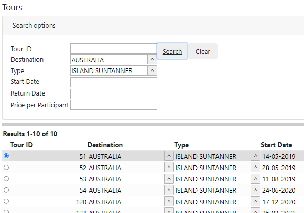
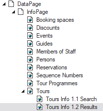

# Pattern 2: Search-and-results across two pages

In this design pattern, Search functionality is offered on a first page. Results are displayed on a second page.

The USoft default has a Search block at the top and a Results block at the bottom of each info page. In this example, the Search was for AUSTRALIA - ISLAND SUNTANNER records and when the user pressed Search the result was displayed below the horizontal line:



 

In the target situation, the first page is dedicated to searching. It only offers the Search block with the Search and Clear buttons:


When the user presses “Search >”, she navigates to a **second** page where the Results are presented. On this page, there is a non-editable “You searched for...” information block at the top. There is a “< Back” button at the bottom that allows the user to go back and do another Search:


To build this solution, in the Web Designer catalog, create 2 subclasses of the Tours info page, one for the Search and the other for the Results:



Then, for the “Search >” button in the first page, replace the standard executeQuery() behaviour by this script:

```js
$.udb('TOUR').executeQuery().then(function(dsc){
  var searchCols = {};   
  dsc.searchCols().each(function(index,col){
      searchCols[col.name()] = col.val();
  });
  $.udb.executeInContext( dsc.context, function(){
    $.udb.navigateTo("Tours Info 1.2 Results").then(function(){
      $.udb('TOUR').searchCols().each(function(index,col){
        col.val(searchCols[col.name()]);
      });
    });
  });
});
```

This is an example of [page chaining](/docs/Web_and_app_UIs/Navigation_between_web_pages/Page_chaining.md), so perhaps you expected that Search column values would be carried over automatically to the second page. However, in page chaining, only Edit values and not Search values are carried over (this is to prevent problems with different Where Clauses in the different pages). For this reason, you need to loop over the Search values as shown if you want to reproduce these values in the second page.

At some points in this code, **.then()** is used for the next action. **.then()** may be used when the call returns a Promise object. Promises are implemented for the executeQuery() call of the udb object, but not for the each() call of the dsc (DataSourceContainer) object.

The **executeInContext()** call is necessary here because otherwise, the context of the query is given up when the** .then()** branch is entered, and here that context is necessary to reproduce what the search conditions were. **searchCols** is a local variable here, so that it is automatically cleaned up and does not interfere with any further query action.

Tweak the GUI to finish:

- In the first page, move the Search and Clear buttons to the bottom, then remove anything not related to Search;
- In the second page, remove the Search and Clear buttons, make the Search fields non-editable, and add the “< Back” button so that it navigates back to the first pages and clears all the input there (code not shown).