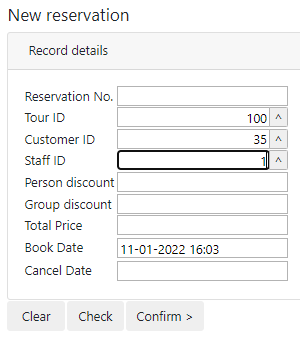
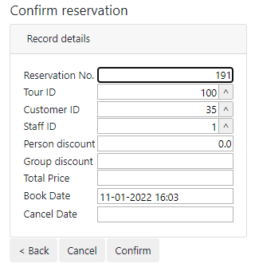
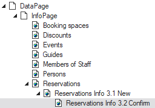

# Pattern 3: Create-and-confirm across two pages

In this design pattern, Create functionality (INSERT, the creation of a new data record) is placed on a first page, and Confirm functionality (the ability to either COMMIT or ROLLBACK the record just created) is offered on a second page. Ensure the data source's initial state is "New Record”.

The first page (for Create) could look something like this:



When the user presses "Confirm >” the application navigates from the first to the second page.

The second page (for Confirm) could look something like this. As you can see, record values from the previous page are repeated, so that the user can make a clean decision as to whether to Confirm (COMMIT) or Cancel (ROLLBACK) the transaction. During page transition, the Rules Engine has calculated some extra values: the Reservation No. primary key, the value for Person discount.

Of course, this is just a schematic example. In a consumer-facing GUI, instead of (or in addition of) the numeric foreign keys for Tour ID, Customer ID, Staff ID, you would provide meaningful textual information and perhaps even graphics: clipart or photos.



In the Web Designer catalog, create a child and a subchild class of the default Reservations info page:



To begin with, strip all the GUI objects from the "Reservations Info 3.1 New”  page except the title, the Record Details side pane, and the button group at the bottom. Do this by right-clicking the various objects in the object tree on the right and then choosing Delete. Then, in the remaining Record Details pane, add the 3 fields that were previously in the grid: those for Reservation No., Tour ID, and Customer ID. All these changes will cascade to the "Reservations Info 3.2 Confirm” page.

In the "3.1” page, add a Clear button with the following script:

```js
$.udb("RESERVATION").rows('current').rowDelete().then(function(){
    $.udb("RESERVATION").rowCreate();
  });

```

Make sure you keep the Check button with the standard **checkData()** action.

Add a "Confirm >” button with the following script:

```js
$.udb.checkData({quiet:true}).then(function(){
    $.udb.navigateTo(
      "Reservations Info 3.2 Confirm",
      {targetFrame:'ApplicationFrame',quiet:true}
    );
});
```

> [!TIP]
> Because this script implements [page chaining](/docs/Web%20and%20app%20UIs/Navigation%20between%20web%20pages/Page%20chaining.md), and because the data sources on the 2 pages have the same name, USoft will automatically carry the data from the first page over to the second page.

In the “3.2” page, add a "< Back” button with the following script:

```js
$.udb.navigateTo("Reservations Info 3.1 New");
```

Change the label of the Rollback button to "Cancel”. Make sure you have a Confirm button with the standard **commit()** action.

Tweak and finish:

- Delete the buttons that you do not want.
- Make the fields in the Confirm page non-editable.
- Add finish to the "< Back” button. If the record displayed was confirmed (committed), the user must return to an empty New box. If the record was not confirmed (committed), the user must return to a New box showing the unconfirmed record.