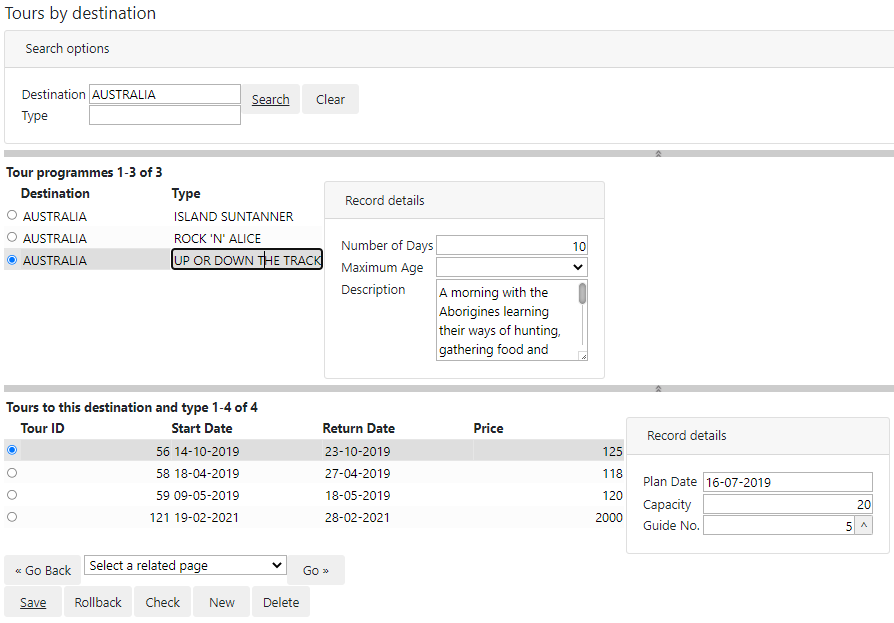
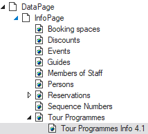
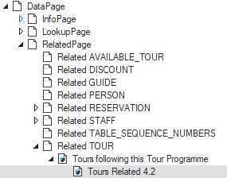
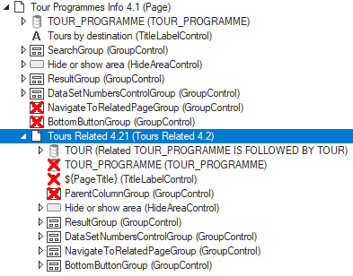

# Pattern 4: Master-detail form on a single page

In this design pattern, the Results area shows 2 data blocks instead of 1.

A user can search Tour Programmes. In the result blocks he can see, at a glance, not just the Tour Programmes but also the Tours on the calendar that belong to the selected Tour Programme.

Result block 2 shows the data belonging to Result block 1. When the uses selects a different record in block 1, the data in block 2 "move along”. At the top, the user can Search for Tour Programmes, as per normal.

This is a "master-detail" form: if you change the selection of the “master” record in block 1, you automatically get corresponding ”details” in block 2.

USoft makes it very easy to create this design, provided you have defined a Relationship in USoft Definer between the 2 underlying tables. Here, the relationship is between tables TOUR_PROGRAMME and TOUR. This gives you a default RelatedPage class based on TOUR and referring to TOUR_PROGRAMME.

To begin with, in the Web Designer catalog, create a subclass of the default Tour Programmes InfoPage class:

Then, create a subclass of the default "Tours following this Tour Programme” RelatedPage class:

From the catalog on the left, open the "4.1” class. Now, from the catalog, **drag** the "4.2” class onto the top-level "4.1” Page object in the object tree on the right. This will cause the "4.2” page object to be *embedded* in the "4.1” object. The embedded object is highlighted in the picture below.

Now drop all the objects that are superfluous in this page combination. Keep the button group (containing the "Save” button) in the "4.2” page, and drop this button group from the "4.1” page. Otherwise, mostly you want to drop objects from the "4.2” page.

:::tip

For example, you can drop the TOUR_PROGRAMME data source from the "4.2” embedded page: you are now in a page combination that already has a TOUR_PROGRAMME data source at the upper level. See that the Relate child object in the TOUR data source has **../TOUR_PROGRAMME** as its Synchronization Datasource: in the USoft default, this data source path refers to the *previous* page, but this time, it refers to the *embedding* page.

:::

Rename labels in such a way that users will clearly understand what is presented in each of the blocks, and also in the page as a whole. The end result could look something like this:

 