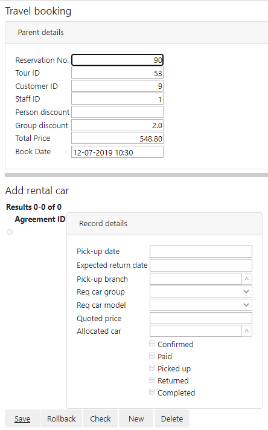
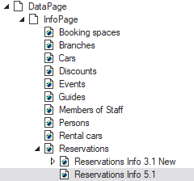
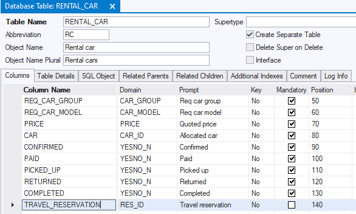
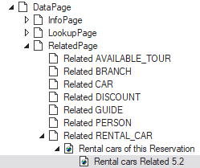

# Pattern 5: Parent box and follow-on insert

In this design pattern, you make a travel booking in a page 1. Then you press a button to navigate to a follow-on page 2. This page 2 has two distinct purposes:

- To re-present the information of the travel booking just made.
- To offer the option of adding a rental car to the booking.

Page 2 looks like this:



The transactions are distinct. The travel booking has already been committed when you arrive in page 2. If a rental car is added, this is a second transaction.

At first sight, this page 2 contains 2 regular info boxes for 2 distinct records. There will be some relationship between the data, but there is no doubt you can script that in JavaScript.

But when you look closer, it is much better to use a Related page class. This approach gives you 2 benefits:

- USoft default "Parent details” boxes in Related pages.
- A data model that correctly supports the follow-on transaction at low cost.

These 2 benefits are explained at the end of this article.

## How to build

Build page 1 as an info page: the "5.1” page class in this catalog structure:



 

The navigation button in page 1 (not shown) should have code like this:

```js
$.udb.navigateToRelated(
  "Rental cars Related 5.2",
  {targetFrame:'ApplicationFrame'}
);
```

Go back to the data model and make sure RENTAL_CAR is given a non-mandatory foreign key referring to travel reservations. Do this by adding a column to the RENTAL_CAR table. This could be a non-mandatory column:



And then defining a parent-child Relationship between RESERVATION and RENTAL_CAR. This could be a relationship with Foreign Key Mandatory = No.

Re-start Web Designer. Build page 2 as a Related page: the "5.2” page class in this catalog structure:



## Benefits of this approach

### USoft default "Parent details” boxes in Related pages

If you use a Related page, USoft automatically implements a **Parent details box** at the top of the page. This box carries over the data from the previous page and shows them again, but this time, the user cannot edit the data - to do that, he needs to go back to page 1.

### A data model that correctly supports the follow-on transaction at low cost

When you are developing data boxes in web pages at GUI level, your first impulse could be to stay at this level, "paint” the boxes, and then script all the required behaviour programmatically.

However, in a USoft technology stack, it is often beneficial to go back to the data model. Not only do you get the correct data structure at database level. You can also "paint” the web pages at lower cost. This gives you a more maintainable solution.


:::note

Even if it is likely that a traveller will only book a single rental car, the built-in possibility to have multiple rental cars probably makes this implementation richer. If you want to prevent users from inadvertantly making a double car booking when this is not intended, the GUI level is the correct level for adding buttons, features, messages, or special record displays to nudge users out of this error.

:::
