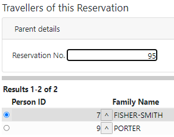
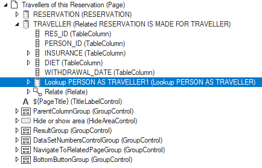

# Pattern 7: Classic joined column

In this design pattern, you display information from a joined column. This information comes from (= is stored in) a parent table, and is displayed in a child table. You look up the information on the basis of the parent-child relationship, ie., by looking at the foreign key value(s) in the child table.

Consider this example. You have a Related page showing travellers of reservation number 95. (“Parent details” refers to RESERVATION being the parent in the RESERVATION-TRAVELLER relationship.)

In the result grid, by default, only the Person ID number is shown. You add a joined column that displays the traveller's Family Name. The family name comes from the PERSON table. This table is the parent of the PERSON-TRAVELLER relationship.



## Creating the data structure

1. From the Web Designer catalog, open the page where you want to add the joined column.

2. In the Controls tab of the catalog, under DataSource Objects, find the lookup data source class  that is able to get PERSON information for a given TRAVELLER. This data source class has a name starting with "Lookup...”.

3. Drag this class onto the data source where you want to add the joined column. Make sure that the inserted data source is embedded as a *child* into that data source. In the example, the added data source object is embedded in the related TRAVELLER data source:



If more than 20 records need to be retrieved from the Lookup DataSource, change the Maximum number of records property to: 0.

## Creating the display

1. In object tree, under the ResultGroup object, find the **MultiRecordResultGrid** node that represents the data grid where you want to add the joined information.

2. Drag an additional **GridCellControl** into this grid object. Set its **Name** to: FAMILY_NAME. Set its **Data Source Item** to the correct option from the dropdown list, in the example:

```
Lookup PERSON AS TRAVELLER1/FAMILY_NAME
```


:::note

If you want to display the joined column not in the **grid**, which is a multi-record display, but in a regular **text box** in the SingleRecordRecordGroup, which is a single-record display, then you need to insert a ColumnControl instead of a GridCellControl. For this ColumnControl, set the Data Source to the inserted data source ("Lookup PERSON AS TRAVELLER1” in the example) and then set the Data Source Item to the FAMILY_NAME column in that lookup data source. Use the dropdown lists provided.

:::

##  Refreshing joined column data after foreign key change


:::warning

When the user selects a (new) value in a lookup page, USoft supports by default that the *foreign key value* in the calling page is updated when you return to that page, but does not support the refresh of the *joined column values.* You must finish this manually.
The solution suggested is acceptable only if you are happy with forcing the user to commit the transaction on lookup. If not, you could consider asking the user at the time he presses the lookup button if he is OK with the current transaction being committed.
Another limitation is that the solution only handles foreign key edits done via the lookup page. It does not handle foreign key edits done by manual typing in the field.

:::

To make sure the joined column data are correctly refreshed when the foreign key value is displayed via the lookup window:

In the script under the Select button of the lookup page, replace the default:

```js
$.udb.acceptLookupValue()
```

by:

```js
$.udb.acceptLookupValue().then( function () {
    return $.udb.commit({ quiet: true });
  }).then( function () {
    return $.udb('TRAVELLER').rows('current').refresh();
  });
```

 