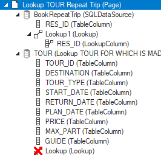

# Pattern 8: Job called by web page

In this design pattern, a job (for a procedural SQL operation) is embedded in web page flow.

The job requires 2 input parameters. One is provided when the user selects a record in a first page. The other is provided when the user selects a record in the second page.

The first page is a regular info page. The second page is a regular lookup page, but the standard lookup behaviour is **replaced** by the job call.

The job returns 1 output parameter. When the user returns from the lookup page, this value is used to display the output of the job in the info page.

## Use case

An info page for Reservations has an added "Repeat trip” button:


This button leads to execution of a REPEAT_TRIP job that creates a copy of the selected Reservation, including related Traveller data stored in a child table and visible in the picture.

This job requires not just a RES_ID input parameter (the selected Reservation) but also a TOUR_ID input parameter that specifies for which Tour the copy must be made. For this reason, before executing the job, the button leads first to a regular lookup page, where the user can select the Tour ID.

Instead of performing regular lookup behaviour, which would be to UPDATE the selected Reservation, the lookup behaviour is customised. When the user returns to the calling page, the job is executed and then the output data of the job are displayed.

## How to build

### Job definition

The job takes 2 input parameters: RES_ID (Reservation ID) and TOUR_ID. It returns 1 output parameter: RES_ID. The output parameter value is a primary key that is a handle for getting the job output data.

The job performs a sequence of SQL manipulations:

```sql
insert into reservation
(
     tour_id
,    *(reservation columns)*
)
select
        i.tour_id
,       *(reservation columns)*
from    reservation r
,       input_parameter_set i
where   r.res_id = i.res_id
;

insert into output_parameter_set
(
     res_id
)
select rulesengine.getlastgenerateduniquevalue()
;

insert into traveller
(
       res_id
,      *(traveller columns)*
)
select
       o.res_id
,      *(traveller-columns)*
from   traveller tr
,      input_parameter_set i
,      output_parameter_set o
where  tr.res_id = i.res_id
;
```

### Calling button

The "Repeat trip” button in the calling page has script:

```js
$.udb.navigateToLookup('Lookup Tour 8.2',
  {mode:'search'}
).catch(function(){
  alert('Navigation to Lookup failed.');
});
```

> [!TIP]
> mode:'search’ is required here because you want to use the output value from the job as a search condition when the user returns to the calling page. You do not want to use this output value for an UPDATE operation, which is what mode:'edit’ (the default) would do.

### Job call

In the called lookup page, insert a SQLDataSource object. Set its **Name** property to:

```
BookRepeatTrip
```

Set its **SQL** property to:

```sql
SELECT  BatchRunner.REPEAT_TRIP(
        :RES_ID RES_ID
,       :TOUR_ID TOUR_ID
,       'True' "-quiet"
)       AS RES_ID
```

Web Designer does not support INVOKE syntax here. You need this SELECT version, which calls the BatchRunner component using function call syntax.

### Custom lookup behaviour

The lookup behaviour, represented by the Lookup object in the called page, must be **replaced** by custom behaviour. See the picture at the end of this alinea.

Delete the Lookup object (in the TOUR data source).

To replace this object, in the "BookRepeatTrip” SQLDataSource, insert 3 new objects: a TableColumn, a Lookup object, and a LookupColumn. Set the **Name** property of the TableColumn to:

```
RES_ID
```

Set the **Synchronization DataSource** property of the Lookup object to:

```
../RESERVATION
```

Set the **Name, Synchronization Column,** and **Data Source Item** properties of the LookupColumn to:

```
RES_ID
```

The result should look something like this:



### Job execution and output display

In the called lookup page, replace the script for the Select button by:

```js
$.udb.wait(true);
$.udb('BookRepeatTrip').executeQuery(
  {
    hostvars: {
      RES_ID: $.udb('../V_RESERVATION').rows('current').cols('RES_ID').val(),
      TOUR_ID: $.udb('TOUR').rows('current').cols('TOUR_ID').val()
    }, 
    error: function(){
      $.udb.wait(false);
    }, 
    success: function(){
      $.udb.wait(false);
      $.udb.acceptLookupValue().then(function(){
        $.udb('V_RESERVATION').executeQuery();
      });
	}
      /* or: 
	    $.udb.closePage({accept:true}).then(function(){
	      $.udb('V_RESERVATION').executeQuery();});
      */
  }
);
```

### Finish

This solution requires finish (not covered in this article). In particular, you need to finish transaction control:

- At the time when the uses presses the calling button, you should probably ask her to commit or rollback any uncommitted manipulations.
- When the user returns, there is a Rollback button in view. Either you must allow rollback of the job action, or else you must end in a page that does not have a Rollback button.