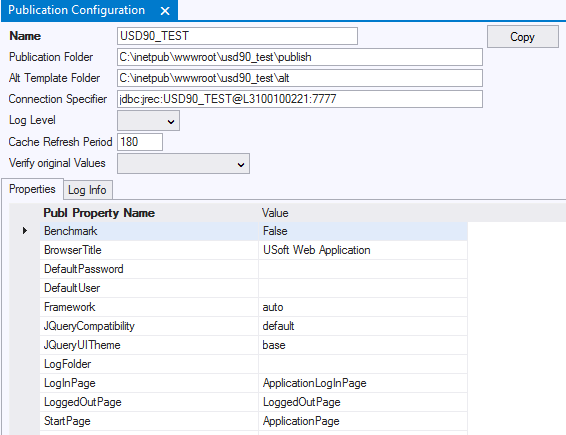

# Publication configurations

A  **publication configuration** is a set of parameters that specify how pages, page sets, or the entire application are published. Every time that one or more pages are published, a publication configuration is used. This configuration determines, among others:

- The web server directory where pages are published.
- The alternative templates folder where your customized templates may be located.
- The Connection Specifier used by the pages to connect to the USoft Rules Service.

> [!TIP]
> Connection Specifier is mandatory, and the New Publication Definition Wizard provides a default value for it, but this setting is actually used only if you implement a Page Engine with IIS and a COM+ component (now obsolete). This setting is no longer used when you define a Page Engine in the USoft Service Definer (now the norm).

## How to create

You can create a new publication configuration by using the New Publication Definition Wizard, or by using the Publication Configuration window.

The New Publication Definition Wizard lets you define the necessary and most important settings of a configuration. See Also: How to Create a New Publication Configuration.

In the Publication Configurations window, you can set ALL parameters for a configuration.

A publication configuration consists of:

- Publication attributes, shown in the upper part of the Publication Configurations window.
- System-defined publication properties, listed on the Properties tab page. You can change their values, but not their names.
- User-defined publication properties. You can add new publication properties with default values that you can refer to in placeholders in scripts.

 

When pages are published, all these settings are written to an **...\\_internal\\uspublication.xml** file that is automatically included in the publication. Do not edit this file manually. Your edits would be overwritten every time you (re-)published any pages.

## How to publish pages against a Publication Configuration

To publish pages:

1. From the Web Designer menu, choose Publish, Publish... or click F8.

The Publish dialog appears.

2. Choose an Object for Publish.This can be a Page, a Page Set, or the Application.

3. From the dropdown list, select the Publication Configuration against which you want to publish.

4. Click OK.

An information message appears once all files are published.

An alternative way to publish an existing publication configuration is to click the right-mouse button in the Pages or Page Sets catalog, and then choose Publish.