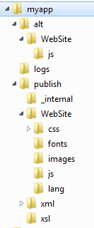

# The Alternative Template Folder

For each publication, you can specify an alternative template folder. In this folder, you can store additional (Java)script files, CSS style sheets, XSL transformation sheets, images, and any other materials that your runtime application needs.

Each time you publish the application, or any of its page sets, or any of its individual pages:

- First, the entire contents of the \<USoft installation>/PageEngine/templates folder (including its structure of subfolders) is copied to the publication directory.

- Second, the entire contents of the alternative template folder (including its structure of subfolders) is copied to the publication directory, overwriting any other published files with the same name in the same subfolder.

Best practice is to have a "WebSite" subfolder in the publication directory which is the IIS virtual directory and which contains all the public material. In this setup, it is essential that the alternative template folder has this "WebSite" folder node as well:

*Example*

|        |        |
|--------|--------|
|Alternatively Template Directory:|...\\myapp\\alt|
|Publication Directory:|...\\myapp\\publish|
|IIS virtual Directory:|...\\myapp\\publish\\WebSite|

 

 

The "xsl" subfolder of the Publication Directory is deprecated and is for backward compatibility only.

> [!CAUTION]
> When using alternative template files, take care when installing a new USoft version. These alternative files must be updated manually.

For example, when using your own version of Strings.js or GenericActions.js it is possible that the default versions of these files are changed. If this happens the changes in the default version must also be implemented in the custom (Alternative Template) version.

Default versions of these files are stored in:

**\<usoft installation folder>/PageEngine/templates/WebSite**