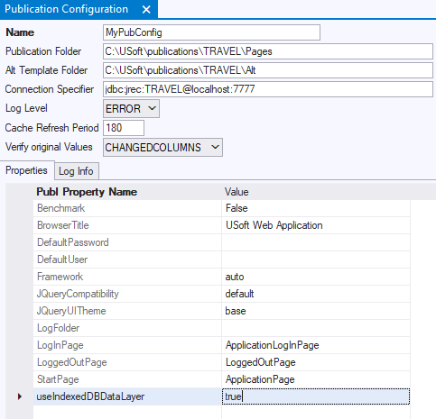

# The application.xml document

When you publish a web application from USoft Web Designer, an "application.xml" file is added to the publication’s **\\WebSite** folder. This file is generated at Publish time: it does not exist in the default publication of your USoft installation.

The “application.xml” file contains publication properties: a list of name-value pairs that looks something like this:

```language-xml
<?xml version="1.0" encoding="UTF-8"?>
<application>
   <param name="ApplicationName">TRAVEL</param>
   <param name="Encoding">UTF-8</param>
   <param name="IsPreview">false</param>
   <param name="ModuleName">.</param>
   <param name="USoftVersion">version 10.0.BETA</param>
   <param name="PublicationTimestamp">1611826420</param>
   <param name="PublicationName">MyPubConfig</param>
   <param name="Benchmark">False</param>
   <param name="BrowserTitle">USoft Web Application</param>
   <param name="DefaultLanguage">en</param>
   <param name="DefaultUser"></param>
   <param name="Framework">auto</param>
   <param name="JQueryUITheme">base</param>
   <param name="JQueryCompatibility">default</param>
   <param name="LoggedOutPage">LoggedOutPage</param>
   <param name="LogInPage">ApplicationLogInPage</param>
   <param name="IsDebug">false</param>
   <param name="StartPage">ApplicationPage</param>
   <param name="useIndexedDBDataLayer">true</param>
</application>
```

The source of these parameter names and their values is stored in Web Designer. To view or edit this source, choose Define, Publication Configuration and retrieve the record for the Publication Configuration you are publishing against, then look at the Properties tab:



You can edit this list of property settings. The example shows a "useIndexedDBDataLayer" publication property that was added manually.


:::danger

Because the "application.xml" file is generated, you must not edit it directly. To add, change or remove entries, edit the source records instead.

:::

At runtime, when your application is started, the “application.xml” file is read and its values are used by the client browser to properly run your website. 


:::warning

In USoft versions prior to USoft 10, publication properties were written to a file called “application.html” instead of "application.xml". The "application.html" file still exists, but is now dedicated to the possibility of adding customised Javascript and CSS styles by putting a copy of this file in the **\\Alt** alternative template directory.

:::
