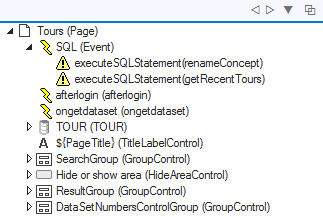
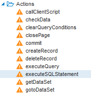
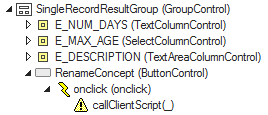

# executeSQLStatement actions

This article is about using an **executeSQLStatement** action in your web page in order to perform additional data manipulation that you write yourself.

## When to use?

Add an executeSQLStatement action to your web page if you need to perform additional data manipulation over and above the data manipulation afforded to your end users when they interact with standard forms based on TableDataSources. You define the data manipulation by writing your own SQL statement.

You can use this technique for straightforward INSERT, UPDATE and DELETE commands, but also for job calls and RDMI calls: if you plan to process the output data or return values of such calls, then on USoft 10, a [SQLDataSource](/docs/Web_and_app_UIs/Data_sources/SQLDataSources.md) is a better alternative.

## Creating an executeSQLStatement action

Create an **executeSQLStatement** Action object in the page where you want to execute your SQL statement. Unless there are special considerations, best practice is to follow the steps below to create a dummy **SQL** Event object with name "SQL" at the highest level in the page (as a child of the Page node). Keep all the Action objects for SQL Statements under this "SQL" node, so that the top of your object tree looks like this:



1. Open the Page class where you want to insert your SQL Statement.

2. In the Controls catalog on the left of your screen, open the Listeners node, and drag an Event object onto the top-level Page node in the object tree on the right of your screen. Double-click on the inserted Event and set its Name to "SQL".


:::tip

Inserting this "SQL” object node is just our suggestion for keeping SQL Statement definitions neatly labelled and easy-to-find even when you have multiple inserted objects at Page level, now or later.

:::

3. In the Controls catalog, find the executeSQLStatement action control:



4. Drag an executeSQLStatement action onto the "SQL" Event in the object tree.

5. In the object tree, double-click on the inserted object to open the Property Inspector for it. Think of a good name that describes the action the SQL will perform (in the example we have "renameConcept" and "getRecentTours"). Set the **Id** and **Name** properties of the object to that name.


:::tip

Setting **Id** is essential. Setting **Name** (to the same value) is practical, but the value of **Id** is what shows up in the object tree.

:::

6. Write the SQL statement you want to execute as a value of the SQL property. Use colons ( **:** ) to introduce bind variables. The value of these bind variables will come from the page when the SQL is executed at runtime. Here is an example of an UPDATE statement with a bind variable **:COUNTRY**.

```sql
UPDATE  journey j
SET
(
        j.sugg_departure
,       j.sugg_arrival
) =
(
        SELECT  j1.variant "SUGG_DEPARTURE"
        ,       j2.variant "SUGG_ARRIVAL"
        FROM    journey_leg j1
        ,       journey_leg j2
        RELATE  j "HAS" j1
        ,       j "HAS" j2
        WHERE   j1.country = :COUNTRY
        AND     j2.country = :COUNTRY
        AND     j2.start_node = j1.end_node
        AND     j1.type = 'INTERNATIONAL'
        AND     j2.type = 'DOMESTIC'
)

```

Here is an example of an INVOKE statement:

```
INVOKE   BatchRunner.RENAME_CONCEPT
WITH
SELECT   :AGENCY             AGENCY
,        :RENAME_FROM        RENAME_FROM
,        :RENAME_TO          RENAME_TO
,        'True'              "-quiet"

```

## Executing the SQL Statement as an HTML event

Execute your SQL statement by associating it with an HTML event on your page. For example, maybe you want to execute the statement when a user presses a button. In that case, the HTML event is **onclick**. The Button object in the object tree must have an **onclick** child Event and that Event must have a **callClientScript** Action:



1. Create the relevant object structure, including the HTML event with which you associate your SQL statement.

2. At the point where you write your script, use a call to **$.udb.executeSQLStatement** in which you call the statement by its Id value. In our example, the following code snippet could be the value of the Script property of a CallClientScript run when the user presses the RenameConcept button:

```js
$.udb.executeSQLStatement('renameConcept',
  {
    waitState: true,
    hostvars: {
      AGENCY: $.udb('PARTNER').rows('current').cols('AGENCY').val(),
      RENAME_FROM: $('#concept-old').val(),
      RENAME_TO: $('#concept-new').val()
    }
  }
)
.catch(function(){
  return $.udb('ORDERS').refresh();
});
```

This code snippet illustrates that you can use **hostvars** settings to pass values from the web page as input parameters to the statement.

## “Catching” result record values of a SELECT statement

`USoft 10.x``{.vs_10}`

On USoft 10, for queries, prefer using a [SQLDataSource]() instead of an executeSQLStatement action.

`USoft 9.x``{.vs_10}`

On USoft 9, see the [USoft 9 alternative for SQLDataSource]() if you want to "catch” a query result in your page so that you can do something with it.