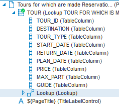
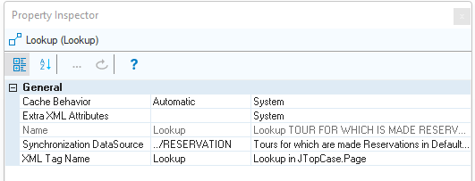

# The DefaultDataSource placeholder

Each page has a default data source. This is the data source object that has its Default Data Source property set to Yes.

The **DefaultDataSource** placeholder refers to the current page's default data source.

*Syntax*

```
${DefaultDataSource}
```

This placeholder allows you to re-use controls and routines in multiple pages without the need to hard-code a different data source name each time.

You can combine this placeholder with elements from [data source path syntax](/docs/Web_and_app_UIs/Data_sources/Data_source_path_syntax.md). For example, you can write the following to refer to the default data source of the page from which the current page was called (see Example 1), or from the page in which the current page is embedded:

```
../${DefaultDataSource}
```

*Example 1*

On the basis of your Definer data model, you have a default Lookup Page called "Tours for which are made Reservations”. This page contains (again, by default) a Lookup object:



This Lookup object has (again, by default) a setting Synchronisation DataSource = **../RESERVATION**:



You want to re-use this same Lookup Page for multiple use-cases. You want it to work also from InfoPages based on Logical Views that give a different view of the RESERVATION table, but are still largely based on the RESERVATION table.

Achieve this by changing the Synchronisation DataSource property of the Lookup object from:

```
../RESERVATION
```

to:

```
../${DefaultDataSource}
```

*Example 2*

In the Controls catalog, you will find a DeleteButtonControl for which the onclick action has the following settings:

```
Action Name: DeleteRecord
Data Source Name: ${DefaultDataSource}

```

These settings are equivalent to the following code snippet:

```
DeleteRecord(${DefaultDataSource}
```

At runtime, when the button is pressed, the ${DefaultDataSource} placeholder is substituted by the name of the data source in the page that has Default Data Source = Yes. The result is that the current record is deleted from the recordset that maps to that data source.


:::warning

Constructs with ${DefaultDataSource} are becoming obsolete. For example, DeleteRecord(${DefaultDataSouce}) is replaced by constructs using .rowDelete().

:::
