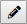
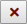
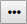
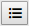

# Editing a test

Clicking **Edit**:

opens up a dialog screen with 2 tabs, "Recorded actions" and "Invocation parameters".

## Recorded Actions tab

### Information displayed

The table in the Recorded Actions tab displays the following information:

|**Column**|**Explanation**|
|--------|--------|
|#       |A sequence number followed by a check box and 3 icons. The checkbox is used for setting breakpoints in the test. See the section below.The Edit icon is used for editing the action. See the section below.The Delete icon is used for deleting the action. Deleting is definitive. It cannot be undone.The Additional options iconoffers action-specific additional options. See the section below.|
|Action  |The name of the recorded action. A full list of actions and their properties can be found in the Reference section.|
|Control |The name of the control affected by the action (the target control). Depending on the control, different information is shown here. Usually, input controls are represented by the control type (Class List in Web Designer), followed by the object name (Type in Web Designer), following by the quoted name identifying the control (ID in Web Designer). Buttons are represented without the object name.|
|Rank    |An integer identifying the target control's occurrence rank. ‘1’ means it is the first occurrence (which usually is the case), otherwise it is a higher number.|
|Row     |The record number of the currently selected record if the target control is a simple input control.The record number in a multi-record control if the control is contained by a multi-record control, such as a GridControl or ReplicatedColumnsControl.|
|Value   |A value (if any) used by the action as a parameter or for comparisons.For example, for a navigation action, this value identifies the page that is being navigated to.|
|Parameters|Additional parameters not covered in the above columns but relevant to the interpretation of the test step. A full list of additional parameters shown here can be found in the Appendix.For example, an identification of the target control's embedding multi-record control (if any) and its occurrence rank.An Additional options icon may appear here as well. This allows selection of additional editing options.|
|Time    |The execution time of the test step.|

### Breakpoints

Clicking the checkbox for an action will add a breakpoint to this action, causing the execution of the test to pause when this action is reached. It will also mark the row for this action with a green color.

Breakpoints are heeded only in Play Test and Play Step modes. In Profiler mode, the test carries on regardless of any breakpoints.

### Editing an action

You can change characteristics of a recorded test action by clicking **Edit:**

for that action. Depending on the type of action, this allows you to change any or all of the action's properties.

For more information on an action's properties, go to the list of recordable actions.

One common task when setting an action's properties is to identify the target control affected by the action.

### Deleting an action

You can delete a recorded test action by clicking **Delete:**

for that action.

:::danger

Deleting a test action is definitive. It cannot be undone.

:::

### Additional options for an action

In actions of a recorded test, you can edit the way in which the test :

- Stores values from controls in variables.
- Applies variables to controls.

Do this by clicking **Additional options:**

for a test action. Depending on the type of action and other characteristics, this may offer you the following options:

|**Option**|**Explanation**|
|--------|--------|
|Store in variable...|This option allows you to change the way in which the test stores a value from a control in a variable.|
|Apply from variable...|This option allows you to change the way in which the test applies a value from a variable to a control.|

### Drag-and-drop to change action sequence

In the Recorded Actions table, you can move actions by clicking the name of the action, holding down the mouse button, and then moving the action to a different place the list. Releasing the mouse button will drop the selected action at that place.

## Invocation Parameters tab

### Information displayed

The table in the Invocation Parameters tab displays the following information:

|**Column**|**Explanation**|
|--------|--------|
|Name    |The name of the invocation parameter. When a user plays the test, this Name appears as the field prompt for the field where she is asked to supply a value for the parameter.|
|Default value|The default value of the invocation parameter. When a user plays the test, this Default Value appears as the default value in the field where she is asked to supply a value for the parameter.|
|Current value|The most recently stored value for the invocation parameter (the value chosen during the last run of the test).If Current value is shown in Bold type, the invocation parameter is Mandatory.|
|Mandatory|If Mandatory = Yes, the user must supply a non-empty value for the invocation parameter.This is represented by the Current Value being shown in Bold type.|

### How invocation parameters work

Invocation parameters allow you to parameterise tests: it allows you to re-run the same test with different input values.

An invocation parameter is an input variable that is passed to a test when it is played:

- If a human tester takes the initiative to play the test, she is asked to supply a value for the invocation parameter at the beginning of the test run.
- If the test is invoked from another test, the value of the invocation parameter is supplied as part of the invocation. In this case the parameter is **by value** and not **by reference**, meaning that you have to set a hard-coded value when you record the invocation. You cannot set a dynamic value at runtime.

### Adding an invocation parameter to a test

1. Make sure you have selected the test in the Current Test dropdown list box in the Web Benchmark control.

2. Press **Edit:**

3. Click the Invocation Parameters tab.

4. Press the Add button. Fill out the fields. Press OK.

### Removing an invocation parameter from a test

1. Make sure you have selected the test in the Current Test dropdown list box in the Web Benchmark control.

2. Press **Edit:**

3. Click the Invocation Parameters tab.

4. Select the parameter you want to remove by selecting the check box.

5. Press the Remove button.