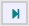

# Playing a Web Benchmark test

While a test is played back, the entire application is made inaccessible to prevent you from influencing the test run by accidently navigating away or changing a value, except when user input is prompted. User input is prompted when:

- The test execution has ended.
- A breakpoint is encountered. Breakpoints are set by checking checkboxes on the left-hand side of the Edit test dialog. Breakpoints are not heeded when a test is played in Run mode (see below).
- An error is raised.

In Run mode only (see below), you can pause or stop a test while it is executing.

To play a test:

1. Select the test in the **Current test** dropdown list box in the middle of the Web Benchmark control.

2. You are now ready to play the selected test in the playback mode of your choice. There are 3 playback modes in Web Benchmark:

 

### Play Test playback mode

Click **Play Test:**

to play the selected test from beginning to end.

If the run is successful, when it completes, you are informed about the total duration of the run. This is the total duration of the most recent sequence of steps run in Play Test mode. If you started out by playing steps in the Play Step mode, their duration is not included in the total reported.

If the run raises an error, an error message will be displayed.

 

### Play Step playback mode

Click **Play Step:**

to play the recorded test actions step-by-step. Each time you click Play step, the next action in line is executed. You are free to explore (the state of) your application after each action step, but be aware that changing data on the screen (or navigating to a different page, dialog or tab) may cause the next action to fail. Also, this mode may not work when you are in a dialog window, because the Web Benchmark control may not be accessible from the dialog. In this case, you may be prompted with an error message (because the control cannot be found), and you can choose ‘Skip’ to continue with the next action.

To play the remainder of the test not step-by-step but until the end, press Play test. Note that the duration reported at the end does not include the step-by-step execution.

To abort step-by-step execution, click **Stop:**

if you want to keep the current test selected, or click **Reset:**

if you want to unselect the current test.

If you play the test step-by-step until the end, no useful information is offered on total duration. This is a difference with the Play Test mode.

 

### Profiler playback mode

Use the Profiler playback mode if you want to :

- Collect error reports and information on throughput times (duration) of test executions.
- Execute a test multiple times.

The primary purpose of the Profiler playback mode is to collect information on a test run.

To play in Profiler mode, click **Run profiler:**

Enter how many times you want the test to run and press OK. When using this feature, make sure your test is suitable for multiple consecutive executions:

- Make sure that the end situation each test can serve as the start situation of the next test.
- Make sure that a start situation does not depend on specific dynamically created values such as sequence numbers.

At the end of a successful run in Profiler mode, an overview of collected throughput information is displayed, which you can use for analyses. The Profiler playback mode is the only mode that creates this overview. It is also the only mode where you can pause or stop a test run while it is executing.

 

 