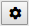

# Recording a Web Benchmark test

Once you have the Web Benchmark control added to your application, you can begin recording tests. Recorded tests can be used within other tests using the Invoke icon, allowing you to use (short) tests as sub-procedures of other, larger tests.

When you come to play the test you want to record, the default starting point is the page that is currently being visited by the browser. For this reason, good practice is to start recording your test by navigating to the intended first page of the test. This way, at play time, you can start the test from any page in your application.

To record a test:

1. Click **Record:**

on the Web Benchmark control.

The control goes into recording mode. This causes some icons to be disabled, while others are enabled.

2. Perform click and type actions that you want to record. Then click **Pause:**

to pause recording actions.

3. When you have performed the last action you want to record, click **Stop:**

The control exits recording mode.

4. Click **Save**

to save the test in the local repository of the Web Benchmark control, then play to see if it works correctly. Alternatively, you can click **Edit**

to edit your recording by changing or removing actions, and click Save when you are done.

### Tab key is not recorded

The action of pressing the Tab key to navigate to a next or previous field is NOT recorded. The only user actions that are recorded are **click** actions and **edit** actions. Edit actions consist of typing text in an input control, or overwriting existing text in a data control.

> [!WARNING]
> As a result, if you want a test to cover data entry in multiple fields, you must remember to **navigate to each new field by clicking the mouse button** and not by pressing the Tab key.

### Drag-and-drop is not recorded

The recorder is not able to detect drag-and-drop action.

### Keystrokes in dialogs are not recorded

When a dialog is open, keystroke actions such as Esc to close the dialog, Enter to press a default button, or Tab to navigate to the next button are NOT recorded. During recording, you must remember to perform these actions by using the mouse button instead.

### Actions on custom controls are not automatically recorded

Actions that affect custom-made controls, for example custom input fields, controls that contain your own HTML, and custom icons, are NOT recorded. Also, actions affecting inserted 3rd-party controls such as Google Maps are NOT automatically recorded. You can make custom controls visible to Web Benchmark. For details see the API documentation.

### Number-of-record checks may be recorded

Activating certain controls such as record set controls causes the application to check data, for example the total number of records on a page. You can have the result of such data checks recorded. Use **Settings:**

for this option.