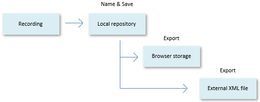
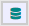

# Saving a Web Benchmark test

You can save a test recording, with a varying degree of permanence, to the *local repository*, to *browser storage*, and to an *external XML file*:

- The local repository is an in-memory store that is part of your Web Benchmark session. This session is automatically lost when you refresh the browser (F5) or close the browser tab or browser program. You can prevent this by setting "Automatically save tests in browser storage" = Yes (recommended), in which case a save to local repository is automatically also saved to browser storage.
- Browser storage, also referred to as "browser cache" or "browser history", is file-based storage maintained by your browser. Browsers keep data in their browser storage until you tell them to flush it, which is referred to as "clearing browser data" or "deleting history".

- The only safe way to permanently store your test recordings is in an external XML file. Tests are grouped in test suites. An XML file created by Web Benchmark contains recordings of all the tests contained in 1 test suite.

When you save a recording to the local repository you must give it a name (a test name). You cannot access a test recording unless you do this first. Once named, you can decide to save the recording to the browser storage (an operation called export), to save it to an external XML file (another operation called export), or both.

### Saving to local repository ("memory")

To save a recording to the local repository:

1. Click **Stop:**

to express that you have finished your recording.

2. Click **Save:**

Provide a Name (a test name) and a Description for the recording and press OK.

The local repository is silently cleared when you close the program. At that time, if you have not saved your recording any other way, it is lost.

 

### Saving to browser storage ("cache", "history")

To save a recording to browser storage:

1. Make sure you have saved the recording to local repository (previous section).

2. Make sure the name of the recording (the test name) you want to save to browser storage, is displayed in the dropdown list in the Web Benchmark control.

3. Click **Manage tests:**

4. In the Manage Tests dialog, in the right-hand pane, select the test name by checking the checkbox, then press the "Export to browser storage" button near the top of the dialog.

 

### Saving to external XML file

To save a recording to an external XML file:

1. Make sure you have saved the recording to local repository (previous section).

2. Make sure the name of the recording (the test name) you want to save to browser storage, is displayed in the dropdown list in the Web Benchmark control.

3. Click **Manage tests:**

4. In the Manage Tests dialog, in the right-hand pane, select the test name by checking the checkbox, then press the "Export to File" button near the top of the dialog.

The test is stored in the browser's Downloads folder in an .XML file by the name of the test suite that the test is in. This test suite name is also displayed in the let-hand pane of the Manager Tests dialog.