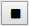

# Selecting a Web Benchmark test

You can **select** a test in the **Current test** dropdown list box in the middle of the Web Benchmark control.

This allows you to play (execute) that test in various playback modes by clicking **Play test:**

, or **Play step:**

,or **Run profiler:**

This also allows you to view a report of test runs of this test by clicking View runs . 

To select a test:

1. Check that the Web Benchmark control is not in recording mode. If the control is not in recording mode, the Record icon is sensitive: it looks like this:

2. If the Record icon is not sensitive, exit recording mode by clicking **Stop:**

or **Reset:**

If there is still an unsaved test, you will be prompted to save it.

3. In the Current Test dropdown list in the middle of the Web Benchmark control, select the test. The dropdown list contains all the tests you have recorded so far, or have loaded into the Web Benchmark control via an external definition file, or have imported using the dialog that appears when you click **Manage tests:**

 