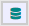

# Test automation with Web Benchmark

Normally you run your tests via the Web Benchmark control and its profiler dialog, but this isn’t automated, i.e. you have to click on everything yourself. However, with a few simple scripts, you can automate most of these actions yourself. In this section we offer a simple manual on how to set up automated test execution.

### Step 1: Set up your test repository

It is unlikely you will always keep all your tests stored in the browser. In fact, your automated tests may likely run on a different machine instead. Therefore, it is important you export your tests (or test suites if you prefer) to XML files (using the options offered in **Manage tests:**



), and read them for each automated test run. You could use the “Initial Definition File” property of the Web Benchmark control to automatically read them if your application (and its tests) rarely changes, however, if this is not the case, you need to read them in a different manner.

The easiest way to do this is as follows:

1. Export your tests to an XML file, and make them accessible on your machine (or network) via an URL. As an example, we assume your test XML file is accessible as “http://localhost/tests/TestSuite.xml”.

2. On your starting page (we assume ApplicationPageWithBenchmark as a default here), add an onload eventListener in the Web Designer, and add a callClientScript action to it. Set the Script property of this action to:

```
$.ajax({
 url: "http://localhost/tests/TestSuite.xml",
 type: "GET",
 async: false,
 success: function (data, status, jqXHR) {
  $.udb.benchmark.trigger("purge");
  $.udb.benchmark.rec.readXML(data);
 },
 error: function(jqXHR, textStatus, errorThrown) {
  console.log(textStatus+":"+errorThrown);
 }
});

```

This will purge any existing tests in the repository, and replace it with the contents of your exported file.

### Step 2: Automatically start tests

This step causes tests to start automatically when the application is opened.

To the onload eventListener of Step 1, add another callClientScript action with the following code:

```
var tests = $.udb.benchmark.getTests();
if (tests.length) {
$.udb.benchmark.trigger("play", {
times: 1, 
perfMode: true, 
batchSet: tests
});
 $.udb.benchmark.on("finishcomplete.test", function() { 
  $.udb.benchmark.trigger("perf.view");
});
}

```

This will gather all currently loaded tests into an array list, and feed them to the playback engine of the Web Benchmark control, to execute all of them. After execution, it will display the “Profile overview” dialog with the results.

However, if you want to (automatically) export the results to an XML file instead, you may want to change the script in the “finishcomplete.test” call to:

```
$.udb.benchmark.trigger("export", {mode: "runs"});

```

### Step 3: Analyse the results

You will find the XML file with your test results in your browser’s downloads folder if you used the “export” event trigger from the previous step.

The results are ordered in one XML element per test, where its main element contains all important information in its attributes (success, execution time, error message, and of course the test time).