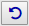
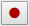

# The Web Benchmark control

USoft Web Benchmark is controlled by the **Web Benchmark control**. This control is a ribbon made up of a series of clickable icons and a dropdown list box:

The Web Benchmark control is embedded in the USoft web application that you are testing with USoft Web Benchmark. The application is made up of web pages. The Web Benchmark control is commonly positioned across the top of the browser area that shows the pages.

The icons are grouped in sections. Each section has its own purpose.

### Recording and playback

Recording and playback is associated with the leftmost section of the Web Benchmark control, which has the following icons:

|        |        |
|--------|--------|
|

|Reset: Resets the control to its initial state. If a test was being recorded, you will be prompted to either keep it or discard it.|
|

|Record:  Starts recording a new test. From the time when you click this icon, every click or value changing action on a USoft control will record one or more actions in the Web Benchmark control.|
|

|Play test:  Plays the test currently selected. All actions are executed until all actions have been executed, or a situation is encountered where an action cannot be executed, for example, because the action's target control cannot be found on the page.|
|

|Play step:  Plays the next step of the test currently selected. Execution is paused after each action. Some recorded actions (such as messages that were encountered) may not work well here, but you are allowed to skip actions that you wish to ignore.|
|

|Pause:  Pauses the recording of a test. No further actions are recorded or played until the Record icon is clicked once more.|
|

|Stop:  Permanently stops the recording of a test. The recording cannot be resumed after this.|
|

|Invoke:  Inserts a previously saved test as part of the test that is being recorded. All actions of the inserted test will be executed on playback. This feature is useful for reusing simple (short) tests that must be executed very often in other (larger) tests.|
|

|Delay:  Adds a fixed delay (in seconds) to your test. Some controls (usually those with external data) may have content that is not immediately available, and may require a test to wait exclusively until this content is displayed. Adding a delay may be necessary in these cases.|
|

|Variables:  Stores the value of the last value check (input field, title field, record ranges, etc.) in a local variable for this test. This is an advanced feature, to deal with value checks of dynamic values that differ per test execution.|
|

|Run script: Executes a JavaScript (and allows you to view its result value). When recording, a Record icon is also present, which allows you to record the script and its result.|
|

|Edit:  Displays a list of all actions for the current test, and allows limited editing of these actions. This feature can be accessed during recording of a test as well.|

 

### Performance testing

These icons are relevant for performance testing. They allow you to execute recorded tests multiple times and then inspect the results.

|        |        |
|--------|--------|
|

|Run Profiler:  Executes the current test multiple times. The results are stored as a performance test that can be compared with previous runs.|
|

|View runs:  Displays a report of test runs for the currently selected test.|
|

|Overview:  Displays an overview of all past test runs, with information on whether or not the last run of each test has succeeded, the error message (reason) on why the last run has failed, the amount of time the test took, and the time when it was last executed. From the overview, you can drill down to more detailed information.|

 

### Test management

These icons allow you to save the most recent test recording by name, to manage the entire set of tests currently loaded, and to manage the settings of the Web Benchmark control itself.

This area has a **Current Test** dropdown list box where you can select the test that you want to play or inspect.

|        |        |
|--------|--------|
|

|Save:  Saves the current test in the local repository of the Web Benchmark control. You can give the test a name and description here, that you may change later (by saving it again).|
|

|Manage tests:  Allows you to manage the collection of tests you stored in the Web Benchmark control. Here you can split your list of tests into groups called test suites, save (export) to file, import from file, or store the current test in the browser’s local storage (if available).|
|

|Settings: Allows you to changes settings of the Web Benchmark control. For example, you can set an execution delay here to slow execution if you want it to run at a watchable speed. Several of the options here have their defaults taken from the properties of the Web Benchmark control as determined in USoft Web Designer.|

###  

### Test monitoring

This area allows developers to get information about the current state of the web application.

|        |        |
|--------|--------|
|

|Debug messages: Shows a history of all recent ‘Developer Alert’ messages that your application has displayed. These messages are for debugging purposes only, and only displayed when your Logging Level publication property is set to ‘DEBUG’.|
|

|Developer info: Shows the current state of your application. Page information (controls), data sources, manipulation transaction state, Page Engine input (ClientState) document: it can all be viewed here. This is meant as an advanced feature, for developers debugging a web application.|