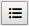

# Using variables in a Web Benchmark test

You can use test variables in a number of ways. Most importantly, variables allow you to:

- Pick up some value from a control and store it for re-use later in the test.

- Test whether some value encountered in a control, at some point in the test run, is in fact the expected value at that point.
- Run ("Invoke") the same test repeatedly with different input values.

Web Benchmark variables can reference not only literal data values, but also the names, occurrences and row numbers (if applicable) of the controls that represent those values, and of other controls.

### Working with variables

You work with variables by using selected options that appear after you click **Variables:**


or **Edit**:


You can store values and properties of input controls in variables, and then (at a later point in the test) apply the variable to a control. By storing the value of an input control in a variable, you can optionally have this operation act as a **check**: the test will check that the value encountered in the runtime control is the same as the value recorded, and otherwise raise an error.

You can also define simple variables that are local to a test, and then use these variable multiple times during a test run. Such variables are name-value pairs (Variable name, Variable value).

Finally, you can also parameterise a test by creating invocation parameters. At the time when the test is played or invoke, a program or the user must pass a value for each invocation parameter.

 

### Property types

You can store different types of property of a control in a variable. "Control value" is the most straightforward and most generally useful of these.

|**Property type**|**Explanation**|
|--------|--------|
|Control value|The literal value (a string, number, date, or text) represented by the control. For a title label, this is the title text. For a database-related input control, this is the database value displayed or held in the control.|
|Control reference|<p>A string such as "S_PERSON_NAME" that identifies the control in the context of a web page. USoft has created a default way of identifying controls, keeping human readability in mind, and avoiding generated numbers. The control reference of each control appears in the generated HTML as the value of the testref HTML attribute.Roughly, a control reference for a database-related input control is made up of:</p><p>- A prefix: S_ for search control, E_ for single-record edit control, ME_ for multi-record edit control;<br/>- A data source name ("PERSON" in "S_PERSON_NAME");<br/>- A column name ("NAME" in "S_PERSON_NAME").<br/></p><p>The control reference for a non-database-related GUI control is usually the name of the HTML surface element, for example, "TitleLabel" for the title across an info page.</p>|
|Control occurrence|<p>The occurrence rank of the control among the controls with this control reference that occur in the web page. The first control on the page with the control reference has Control occurrence = 1, the second has Control occurrence = 2, and so on.</p><p>Control occurrences are only of interest only if multiple control instances with the control reference exist on the page. This happens in structures that duplicate controls, such as ReplicatedColumnsControls.</p>|
|Row index|The sequence number of the occurrence of a database record in a structure that holds multiple database records of the same type in a multi-record display, especially in GridControls.|


 

 

### Dynamic value Y/N


When you store a value from a control in a variable, you can set "Dynamic value" = Yes if the value is allowed to be different between test runs:

|**Dynamic value**|**Behaviour**|**Implementation**|
|--------|--------|--------|
|No (the default)|When the test is run, the value encountered in the runtime control is checked against the value recorded:If the values are the same, the value is stored in the variable and may be referenced in later test steps by referencing the variable.If the values are not the same, an error ('Assertion failure") is raised, which a user who runs the test interactively has the option to skip.|<p>The value recorded is stored as part of the test. It may be viewed in the *Edit test* screen.</p><p>The action recorded is **assert** with Assert Type = **Equals**.</p><p>This implementation may be viewed in the Edit test screen.You can edit this implementation.</p>|
|Yes     |When the test is run, a check is performed to make sure that the runtime control contains a non-empty value:If the runtime control has the empty value, an error ("Assertion failure") is raised, which a user who runs the test interactively has the option to skip.If the runtime control has a non-empty value, that runtime value is stored in the variable and may be referenced in later test steps by referencing the variable.|<p>The value recorded is NOT stored as part of the test. Instead, the empty value is stored.</p><p>The action recorded is **assert** with Assert Type = **NotSame**.</p><p>This implementation may be viewed in the *Edit test* screen.You can edit this implementation.</p>|


 

 

### Storing a value from a control in a variable


Storing a value from a control in a variable has, by default, 2 potential effects at runtime:

- Check effect: If the value encountered in the runtime control is different from the value recorded, an error is raised.
- Store effect: If the value encountered in the runtime control is the same as the value recorded, the value is successfully stored in the variable for re-use in a later test step.

You can remove the **check** effect by setting "Dynamic value" = Yes when you store the value (see previous section in this help topic). You can also edit the test manually in various ways.

To store a value from a control in a variable:

1. While recording a test, make sure you have some value of interest in your screen. This could be a value currently displayed in a search field, or retrieved in an edit field, or displayed in the GUI layer, for example, as the title of the current page.

2. Click **Variables:**


3. From the context menu, select "Store value or property in variable".

The "Store value in variable" dialog appears.Web Benchmark is now waiting for you to identify the value that you want to store.

4. Identify this value clicking on the control that holds the value.

5. Accept the "Variable name" proposed as a default, or make up your own variable name.

6. Accept the setting "Property Type" = "Control value". Press OK. Continue recording your test as per usual.

The value has now been stored in the variable. You can trace this fact by clicking the Edit button and seeing an assertEquals entry for the control. The variable name and the stored value are registered in this entry.

7. If you do not want the test to check that the value encountered in the runtime control is the same as the value recorded, set Dynamic = Yes. For details, see the "Dynamic value Y/N" section earlier in this help topic.

 

### Applying a variable to a control

 To apply a previously stored value to a control:

1. While recording a test, make sure you have some control in your screen where you want to apply a value stored in a variable.

2. Click **Variables:**


3. From the context menu, select "Apply variable to control".

Web Benchmark is now waiting for you to identify the input control you want to apply the stored value to.

4. Click on that input control.

The "Set value from variable" dialog appears.

4. Identify the variable by selecting its name from the "Variable name" dropdown list

6. Accept the setting "Property Type" = "Control value". Press OK. See that the stored value appears in the control. Continue recording your test as per usual.

The value is now stored in the variable. You can trace this fact by clicking the Edit button and seeing a **setValue** entry for the control. The value appears in the syntax for referring to the contents of a named variable, for example:

 

```
:{S_PERSON_NAME}
```

 

### Defining a variable

You can define a variable as a name-value pair that is not immediately related to any control on a web page.

Such a variable is a local variable within your test. Once the variable has been defined, you can refer to its value by the name. You need to do this by manually editing the test (by clicking **Edit:**



). 

To define such a variable:

1. At any point during your test recording, click **Variables:**


2. From the context menu, select "Define variable".

3. Enter the variable name and variable value and press OK.

 

### Defining an invocation parameter

An invocation parameter is an input variable that is passed to a test when it is played:

- If a human tester takes the initiative to play the test, she is asked to supply a value for the invocation parameter at the beginning of the test run.
- If the test is invoked from another test, the value of the invocation parameter is supplied as part of the invocation.

To define an invocation parameter for a test:

1. Make sure that the test is selected in the Current Test dropdown list box in the Web Benchmark control.

2. Click **Edit:**


3. Click the Invocation parameters tab.

4. Click the Add button and set the Name, Default Value, and Mandatory fields. For details, read the "Invocation parameters tab" section at the end of this help topic.

 

###  

 