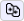
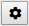

# Web Benchmark Profiler: Comparisons

You can view a comparison between test runs of a selected test.

To view a comparison:

1. Select the test in the Current Test dropdown list box in the middle of the Web Benchmark control.

2. Click **View runs:**

As an alternative for Steps 1 and 2, you can click **Overview:**

and then click on the name of the test for which you want to see comparisons.

3. Using the checkboxes on the left, select the test runs you want to compare.

4. Click the 'Compare the selected test runs" icon:

A comparison for runs of the selected test is displayed.

You can control what information you want displayed. Make the settings discussed here by clicking the **Settings** icon:

- The User Actions tab can be hidden by setting "Display overview of all runs" = No. You can set this as the default by using the "Display overview" property of the Web Benchmark control in Web Designer.
- The individual execution times on the User Actions tab can be hidden by setting "Display run times per individual action/event" = No. You can set this as the default by using the "Display individual run times on overview" property of the Web Benchmark control in Web Designer.
- The Events per User Action and Events Profile tabs can be hidden by setting "Display eveents profile" = No. You can set this as the default by using the "Display overview" property of the Web Benchmark control in Web Designer.
- The Message Log tab is hidden by default. It may be displayed by setting "Display message log" = Yes.

### User Actions tab

This tab shows the following columns.

|**Column**|**Explanation**|
|--------|--------|
|Action  |The name of the action itself. A full list of actions and their properties can be found in the Appendix.|
|Control |The name of the control affected by the action (the *target control*). Depending on the control, different information is shown here. Usually, input controls are represented by the control type (Class List in Web Designer), followed by the object name (Type in Web Designer), following by the quoted name identifying the control (ID in Web Designer). Buttons are represented without the object name.|
|Rank    |An integer identifying the target control's occurrence rank. ‘1’ means it is the first occurrence (which usually is the case), otherwise it is a higher number.|
|Row     |The record number of the currently selected record if the control is a simple input control.The record number in a multi-record control if the control is contained by a multi-record control, such as a GridControl or ReplicatedColumnsControl.|
|Value   |A value (if any) used by the action as a parameter or for comparisons.For example, for a navigation action, this value identifies the page that is being navigated to.|
|Parameters|Additional parameters not covered in the above columns but relevant to the interpretation of the test step. A full list of additional parameters shown here can be found in the Appendix.For example, an identification of the target control's embedding multi-record control (if any) and its occurrence rank.|
|Average |        |
|#1      |        |
|#2      |        |

### Events per User Action tab

The Events per User Action tab shows more execution details for each action, by displaying the event details (event name, client/server type, its target parameters, etc), and how long it has taken to execute this event. These events are all sorted on their timestamps of starting and finishing.

In the case it is a server (Page Engine) event, it will also have a prefix “Id” between brackets, corresponding with the “stateId” attribute in their corresponding Page Engine logs.

If more than a single log is compared in this dialog, then you must click on the “Event details for run #\<number>” boxes to view the details for that log.

### Events Profile tab

The Events Profile tab shows a more elaborate execution path of the events that were executed during a test run.

The indentation of the event name means that this event has been executed as part of the event above it (if it has less indentation, otherwise it is just a next event inside of another event), the values in the “Parameters” section show the list of parameters that were used for that event. This information is very useful for discovering if your page performs as best as possible, by finding events that are executed unnecessarily, or taking too much time to execute. The times on the right are the milliseconds passed since start of the test, not the actual execution time of that specific event.