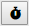

# Web Benchmark Profiler: Viewing test runs of a test

By clicking **View runs:**

you can view a report of throughput times of all test runs of the current test.

This report covers only test runs that you have started by clicking **Run profiler:**

It does NOT cover any playback sessions started with **Play test**:

or with **Play step:**

This report covers all the past test runs for the test. You can exclude test runs from the report by deleting selected test runs. To do this, select the test runs you want to delete and then  press the Delete... button in the left bottom corner.

This report allows you to drill down to throughput times of a specific test run, and from there, to throughput times of individual user actions in the test run, and of events per user action.

To view test runs of a test:

1. Select the test for which you want to view test runs.

2. Click **View runs:**

An overview of test runs of the test is displayed with the total execution time for each test run.

In this report, you can **navigate**:

- To details of a test run by clicking on the Date/time hyperlink of that test run. Details are shown on 3 distinct tabs: User Actions, Events per User Action, and Events Profile.

- To test runs of *other* tests by clicking the Return To Report button in the bottom right corner. This leads to the same overview that you get by clicking **Overview** in the Web Benchmark control:

In this report, you can **view**:

- Total execution times for each test run.
- Dates and times of each test run.
- For each test run, whether the run was successful or not, and (if not) what was the error message raised.

Using this report, you can also **perform** a number of actions by pressing buttons at the bottom of the screen:

- You can select test runs (click the checkboxes on the left) and then delete them;
- You can compare selected test runs;
- You can export execution logs of selected test runs;
- You can re-run selected tests in Profiler mode, indicating the number of times you want to re-run the tests.