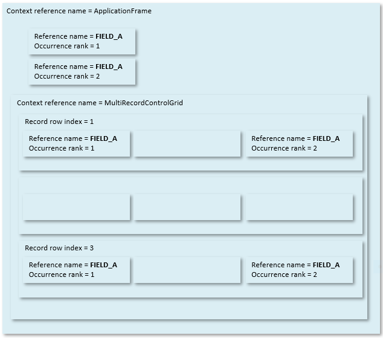

# Web Benchmark test editing: Identifying target controls and their properties

## Target controls

The **target control** of an action is the control in the web page that the action has an effect on.

When editing tests, to point at the target control you want to affect, you use a combination of different properties, in particular: Source frame,  Reference name,  Occurrence rank (or Rank), Record row index (or Row index or Row), Context reference name, and Context occurrence rank.

The picture below illustrates the principle. A page has 6 fields with Reference name = FIELD_A, which is the value of the HTML **testref** attribute for each of these fields:

- The first 2 fields occur in a single-record display contained directly by the ApplicationFrame object. They can be uniquely identified by the combination of their Context reference name and Occurrence rank.

- The last 4 fields occur in rows in a multi-record display (a grid). They can be uniquely identified by the combination of their Context reference name, Occurrence rank, and Record row index.

## Target control properties

The following properties are common to the target controls of many actions.

|**Target control property**|**Explanation**|
|--------|--------|
|Source frame|The object name of the HTML frame that is the context in which the target control is found.|
|Reference name|
A string such as "S_PERSON_NAME" that identifies the target control in the context of a web page. USoft has created a default way of identifying controls, keeping human readability in mind, and avoiding generated numbers.

The reference name of a control appears in the generated HTML as the value of the **testref** HTML attribute.

Roughly, the reference name of a database-related input control is made up of:

- A prefix: S_ for search control, E_ for single-record edit control, ME_ for multi-record edit control; - A data source name ("PERSON" in "S_PERSON_NAME"); - A column name ("NAME" in "S_PERSON_NAME") 

The reference name of a non-database-related GUI control is usually the name of the HTML surface element, for example, "TitleLabel" for the title across an info page.
|
|Occurrence rank|
The occurrence rank of the target control among controls with the same reference name within the web page. The first control has Occurrence rank = 1, the second has Occurrence rank = 2 and so on.

Occurrence ranks are only of interest if multiple controls exist with the reference name. This happens in structures that duplicate controls, such as in Grid Controls or Replicated Columns Controls.
|
|Record row index|
The sequence number of the occurrence of the target control's database record in a structure that holds multiple database records of the same type in a multi-record display, especially in GridControls and ReplicatedColumnControls.

This characteristic applies only if the target control is a member of a multi-record control, in which case that multi-record control must be specified as the *context control.* You do that by setting Context reference name and Context occurrence rank.
|
|Context reference name|The reference name (see above) of the control that is the context control of the action's target control.|
|Context occurrence rank|The occurrence rank (see above) of the control that is the context control of the action's target control.|

 