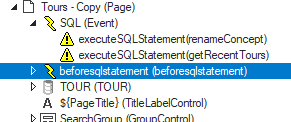

# beforesqlstatement


> [!NOTE]
> This article is about the **beforesqlstatement**[ UDB event handler](/docs/Web%20and%20app%20UIs/UDB%20Events).

## **beforesqlstatement**

The **beforesqlstatement** event may be called from web pages developed in Web Designer and processed by a USoft page engine service.

|**Event**|**Applies to**|**Occurs when**|
|--------|--------|--------|
|`beforesqlstatement`|Page objects|Before each call to $.udb.executeSQLStatement()|


## Purpose

You can use this event to block processing if the event occurs and a given condition is not satisfied.

## How to use

Find or create an Event Listener object with Event Type = beforesqlstatement. Event Listeners are in the Web Designer Controls catalog:


Insert the event listener into the Page object. Insert a callClientScript action into the event listener. Use this action's Script property to code the behaviour that you want to see when the event occurs. A typical pattern is to specify the condition under which you want processing to be blocked, to block the process, and to give an error message in an alert box. This pattern looks like this:

```js
if ( *condition-not-satisfied* ) {
  options.success = false;
  alert( *message* );
}
```

You are implicitly associating the event with an event handler function. This function has an options parameter. For available options, see the Options section at the end of this help topic:

```js
function(*evt*, *options*){ ... }
```

Or you can create the event handler more explicitly by calling **$.udb.on()**.

## Tying the event handler to a specific SQL Statement

Because a beforesqlstatement event applies to the Page object, it will handle any SQL statement executed from the page. In this example, 2 different executeSQLStatement actions (called renameConcept and getRecentTours) are apparently executed from different locations in the page. Because of its Page scope, the beforesqlstatement event will fire in *both* cases:



To restrict event handling to a specific SQL Statement, refer to the options.id property, which is passed the Id of the SQL Statement currently being executed (for an explanation, see the Options section at the end of this help topic):

```js
if ( options.id === 'renameConcept' ) {
  if ( *condition-not-satisfied* ) {
    options.success = false;
    alert( *message* );
  }
}
```

## Options

When the event occurs, the following event handler function is called. You can use this function's options parameter in your event scripting.
 

```js
function( 'beforesqlstatement', *options* ){}

*options*   ::=  *event-options*

*event-options*   ::=  {
     success:  *success*,
     id:       *id*,
     options:  *caller-options*
}

*success*  ::=  { true | false }
```

This implies that

- you can refer to the success property by scripting: options.success,
- you can refer to the id property by scripting: options.id,
- you can access the caller options by scripting options.options.caller-option.

If you set the **success** property to false, processing is interrupted. As a result, the SQL statement will not be executed.

The **id** property refers to the Id property of the .executeSQLStatement() action that triggered this event. Use this property if you want to restrict event handling to a specific SQL Statement on the page. See the "Tying the event handler to a specific SQL Statement" section earlier in this help topic.

*Caller-options* are the options exposed by the .executeSQLStatement() function of the calling page object.