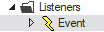

# dataset

The **dataset** event may be called from web pages developed in Web Designer and processed by a USoft page engine service.

|**Event**|**Applies to**|**Occurs when**|
|--------|--------|--------|
|dataset |Page objects|When data is received for any data source in the page.|
|dataset |Data source objects|When data is received for the data source.|


At the time when data is received, you can address the retrieved values, but no retrieved row has been designated as the “current row” as yet.

## How to use

Find or create an Event Listener object with Event Type = dataset. Event Listeners are in the Web Designer Controls catalog:



Insert the event listener into the page or data source object. Insert a callClientScript action into the event listener. Use this action's Script property to code the behaviour that you want to see when the event occurs.

## Example

```js
alert(this.rows().length+" records queried");
```

where, assuming the dataset event occurs at data source level, **this** is the data source object.

You are implicitly associating the event with an event handler function.

```js
function(*evt*){ ... }
```

Alternatively, you can create the event handler more explicitly by calling $.udb.on() (if the event handler applies to the Page object) or by calling $.udb('data-source').on() (if the event handler applies to a data source object)