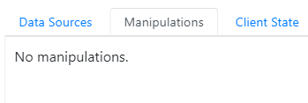

# ustabs()


----

`USoft 11``{.vs_11}`


:::danger

This article describes the USoft 10 product only.
In USoft 11, the web UI API was revised and improved. For full details, go to:
[Revised web UI API in USoft 11](/docs/Web_and_app_UIs/UDB_udb/Revised_web_UI_API_in_USoft_11.md)

:::

----

`USoft 10``{.vs_10}`


:::note

This article covers the **ustabs()** function as part of the [UI Library](/docs/Web_and_app_UIs/UI_Library).
The UI Library is a mixed bag of Javascript extensions for programming UI controls in USoft web pages. Do not confuse with the structured [UDB object model](/docs/Web_and_app_UIs/UDB_udb/UDB_udb_object.md) for data exchange between USoft web pages and a Rules Engine.

:::

The **ustabs()** function creates a framework-independent 'tab control' on the basis of a UL element containing LI elements. A tab control shows one panel at a time, depending on which tab was last clicked on (the "active" tab):



The individual panels are represented by DIV elements that have an id attribute. Each panel contains an A element with a href attribute that corresponds with the id of the panel. The entire construct (the UL list and all the DIV elements) is contained within the HTML element on which the .ustabs() function executes.

Returns the HTML element.

*Syntax*

```js
.ustabs( *command*, *tablist* )
.ustabs( "destroy" )
.ustabs( *options* )

*command*         ::=  { "enable" | "disable" | "active" }

*options*   ::=  {
    collapsible: *collapsible*,
    disable: *tablist*,
    beforeActivate: *before-activate-function*
}

*collapsible*    ::=  { true | false }
*disable*        ::=  *tablist*

*tablist*         ::=  { *tablist-string* | *tablist-array* }
*tablist-string*  ::=  *tab*
*tablist-array*   ::=  [ *tab*, *tab*... ]
*tab*             ::=  { *integer* | *string* }
```

You must call **.ustabs()** with either a *command* keyword, the "destroy" keyword, or with an *options* struct.

*Command* is a string keyword that indicates how the state of the button is altered:

- "enable": enables one or more tabs (causes the tab(s) to be "clickable")
- "disable": disables one or more tabs (causes the tab(s) to be no longer "clickable")
- "active": changes the active tab pane.

With these keywords, a second parameter (*tablist*) determines which tab or tabs is to be affected.

*Tablist* is either an individual value indicating an individual tab, or an array of values enumerating multiple tabs. These values can be integers referring to the index value of the tab within the tab control, or they can be string values referring to the value of the id attribute of the tab.

Calling **ustabs()** with the "destroy" keyword turns the containing HTML element back to its original state and destroys the tab context.

*Options* is a struct that can have the following items, all of which are optional.

*collapsible* may be set to a collapsible boolean that determines what happens if a tab is clicked twice in a row. If set to ‘false’ (the default), nothing happens in this situation. If set to 'true', the tab’s panel is hidden on the second click.

*disable* may be set to a *tablist* indicating which tab or tabs are to be disabled by default. In the same way as with the *command* option, a *tablist* is either an individual value indicating an individual tab, or an array of values enumerating multiple tabs. These values can be integers referring to the index value of the tab within the tab control, or they can be string values referring to the value of the id attribute of the tab.

*before-activate-function* may be set to a function that is executed each time a new tab is selected. The function executes just before the new tab panel is made visible.

*Examples*

```js
var $tabs = $(".tabs");

$tabs.ustabs({
      disable: ["details", "result"]
});

$tabs.ustabs( "active", 3 ); // activates the 4th tab, index is 0-based
```

 