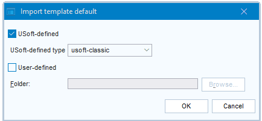

# Template default: Switching to usoft-classic

By default, your web application has the 'usoft-zero’ factory template default.

You can switch to the 'usoft-classic’ template default. This was the default for USoft 10 and earlier. To see photos that give an impression of both ‘usoft-zero’ and 'usoft-classic’, go to [Default web application](/docs/Web%20and%20app%20UIs/USoft%20template%20defaults/Template%20defaults%20as%20a%20concept.md).

> [!CAUTION]
> This switch is intended as a one-time initialisation decision. If you want to do this after you have already done much work in Web Designer, you likely need to do a lot of manual debugging to repair and rebuild.

To switch to the 'usoft-classic’ template default:

1. Open Web Designer.
2. Choose Tools, “Import template default” from the main menu. A dialog appears.
3. In the dialog, make sure the “USoft-defined” checkbox is checked, then set “USoft-defined type” = , then press OK:

4. Close Web Designer.
5. If you had already done publication work, on the file system. remove all folders and files from the publication directory you have been using in Web Designer.
6. Re-open Web Designer.
7. Re-publish. Restart Page Engine and Rules Service. The runtime application should now have the usoft-classic look-and-feel.