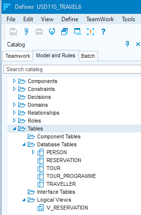
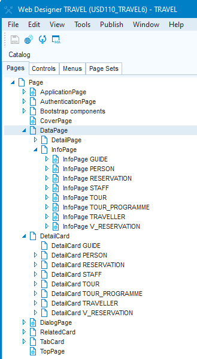
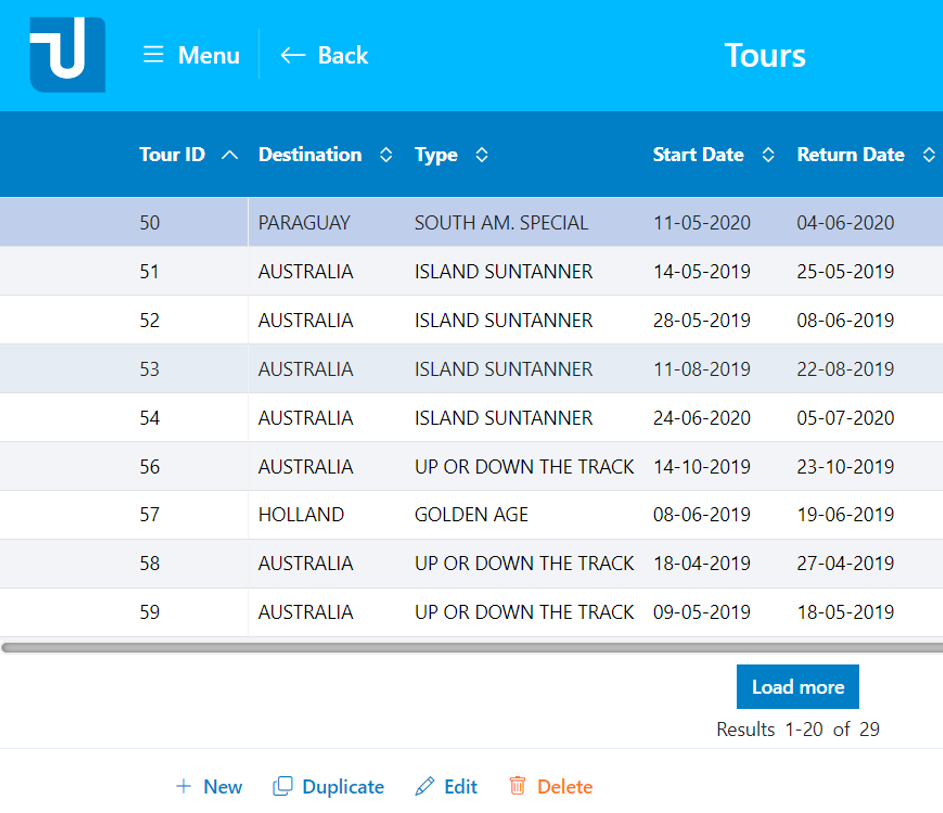
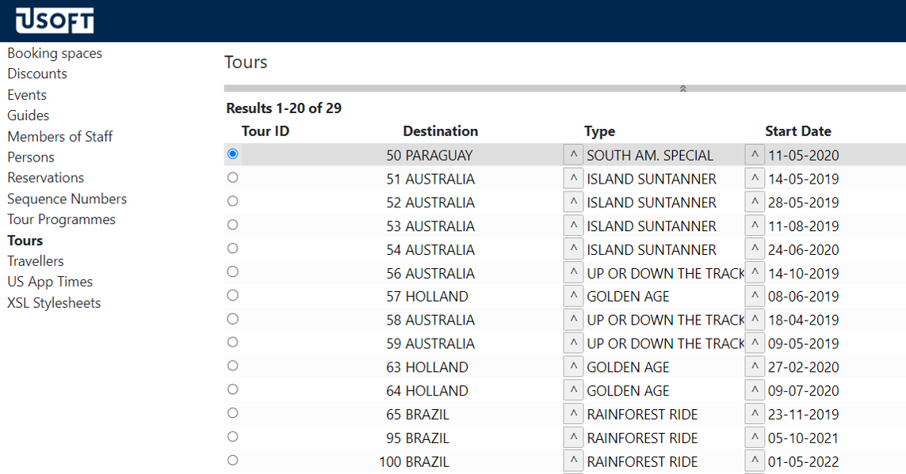
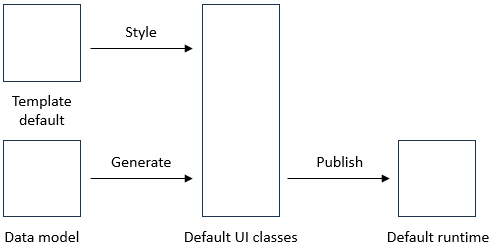
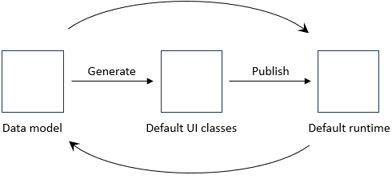
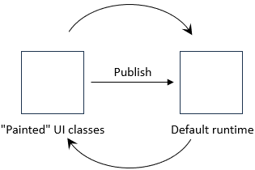
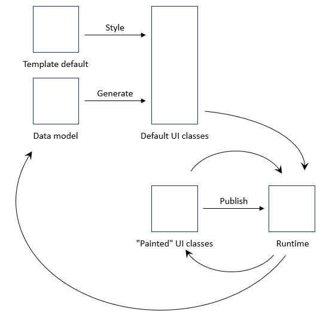

# Template defaults as a concept

## A USoft web application is a web site based on a data model

USoft gives you low-code development of web applications on the basis of a data model.

All you need is the data model. USoft will generate a fully functional, data-intensive runtime web site for you. By default, this generated site allows runtime users to query and manipulate business data stored in the data model.

In order to generate a web application on the basis of a data model alone, USoft needs to make many implicit decisions about page structure, navigation, and desktop publishing of the visual aspects of the site.

This set of decisions we call the underlying *template default* of the web application. Template defaults are also called *web UI default*s, *web defaults,* or even *defaults* for short.

Each USoft web application has exactly 1 underlying template default.

## USoft template defaults

By default, USoft applies its own template default. This is the **usoft-zero** template default.

USoft 11 ships with 1 other template default - the **usoft-classic** default from USoft 10. It is easy to [switch](/docs/Web%20and%20app%20UIs/USoft%20template%20defaults/Template%20default%20Switching%20to%20usoftclassic.md) from usoft-zero to usoft-classic.

## Your own template default

You can decide to [declare your own template default](/docs/Web%20and%20app%20UIs/Your%20own%20template%20default/Template%20default%20creating%20and%20reapplying%20your%20own%20defaults.md) instead of using a USoft default. You do this by modifying an XML file. USoft has a small declarative XML language for this purpose.

Creating your own default is a one-time action that you do at the beginning of a development project. It allows you to preset all major aspects of your UI in one go. It is easy to re-apply an existing custom default to a new project.

## Declaring a default vs. repainting a default

Template defaults can be a confusing concept for beginners, because once you have chosen a default, you can still "repaint” every UI and UX aspect of it: you can change it so much that it really becomes something else.

So why worry about choosing an initial default?

### The default determines your Web Designer toolbox

Imagine you have declared a data model in USoft Definer:

 

When you open USoft Web Designer, in the Web Designer catalog, you see a default toolbox of page and card classes that is the starting point of your UI development work. Exactly how the data model is translated into these classes depends on the chosen template default.

For example, if you stay with the USoft-delivered usoft-zero default, this is what you see when you open the Web Designer catalog:

As you can see, the usoft-zero default is characterised by collections of things called *pages* and *cards.* This is specific to this default. If you opt for usoft-classic instead, you get pages but not cards.

If you decide to declare your own default first, you have full control over your initial toolbox.

### The default determines what the default runtime looks like

USoft's low-code proposition means that you can publish a fully-functional, browsable runtime web application from the default classes at the press of a button. This is the Publish button in USoft Web Designer.

If you decide not to do any development work in Web Designer, but publish the default straight away, you get a default runtime application determined by the template default underlying your project:

Here is an impression of what the runtime looks like if the default 'usoft-zero’ default is chosen. This is a standard page for a tour operator. It interacts with their TOUR database table. They just defined the TOUR table and did not do any "painting work” in Web Designer, so all the details you see come from the usoft-zero look-and-feel:

----

----

 

Here is an impression of what the runtime looks like if 'usoft-classic’ is underlying. The only thing customised ("painted”) here is the dark blue header bar with the USoft logo:

 

----

----

As you can see, default runtimes give you fill-in-the-form web pages, one page for each database table. But they do a lot more. Here are just a few examples of how USoft Definer work affects your default-generated web pages:

- Fields in web pages become wider or narrower if you change the Length of a domain on which a column is based.
- Page titles, menu options and field prompts change if you change the Object Name for a table or the Prompt for a column.
- Data elements appear either in a grid or in a form with single-record fields depending on whether or not you set a column's In Display Selection attribute.
- From a foreign key field, the user can lookup possible values for the field, then select one to be put in the field as foreign key value. Depending on Lookup Method, the user can get a dropdown list with values, or even an excursion to a pop-up lookup window on the parent table.
- Domain Constraints and Table Constraints in USoft Definer will determine how data is enriched and how data constraints are enforced when users start interacting with these data through pages developed in Web Designer.
- Defining a new Logical View in USoft Definer automatically gives you a web form for data interaction with that view in Web Designer.

### A web application is initially styled by a default, and then customised

The look-and-feel of a default runtime is generated from the data model and styled by the template default. This results in a collection of default UI classes in Web Designer. There, you publish to get the runtime:

The default styles visual aspects such as colours, fonts, sizing and positioning, but also the *behaviour* and *features* of the end product: page structure, navigation paths, screen behaviour, and functionality offered through buttons, icons and links.

### Data model change is iterative

Because so much is generated and defaulted, you can inspect the end product in a browser and then quickly make desired changes at low cost. All you need to do is change the data model, re-start Web Designer, and re-publish the default UI classes.

### "Painting” is iterative

You want to benefit from high-level low-code iteration, but you also want full control over the details of the finished end product. The purpose of Web Designer is to allow you to refine the detailed look-and-feel of the web pages. This process is equally iterative, but closer to what is commonly known as web development. Inspect the generated result in the browser, make changes to the Web Designer classes and perhaps surrounding layers of CSS and JS, then re-publish and inspect. This is a smaller iteration circle often called "painting”.

The word "painting” by itself evokes setting colours and shapes and not much else, but here, it is a metaphor for refining all the details of the end product, including page structure, functionality and behaviour. The result may be summarised by "UI/UX”: user interface and user experience.

You need the flexibility to "paint” but, *concurrently,* to expand and change the data model, even *after* you have been doing "paintings”. Therefore USoft allows you to make changes at the two levels in parallel. Two kinds of iteration go on at the same time:

You can go back and forth between the levels in any order. In practice, "paintings” are usually smaller and more frequent than data model changes.

As you add new elements to the data model, you get new default UI classes, that you can then begin to paint. As you change **existing** data model areas, there could be an effect on already "painted” classes in Web Designer. This effect is sometimes unpredictable. However, because of USoft's excellent separation of concerns, you can usually continue developing already "painted” aspects of your web application with ease, even when the underlying data model changes.

## Template default is a one-time decision

This same flexibility does **not** apply to template defaults. The template default is a one-time initialisation. This is expressed in this picture, where the template default appears **outside** the iteration circles:

> [!CAUTION]
> If you decide to change the template default later in the development process, the effect on Web Designer classes is uncertain and may be undesirable. You will need to do manual testing and reparation work.