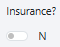
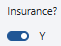
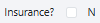
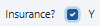
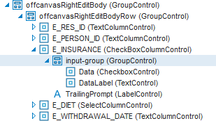
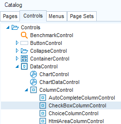
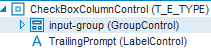

# usoft-zero checkboxes

## ​Idea

The usoft-zero default shows Bootstrap-style *toggle switches* for booleans. For a boolean indicating if a traveller has taken out the insurance scheme or not, the default for the ‘N’ value looks like this:



and the default for the ‘Y’ value looks like this:



A popular alternative for toggle switches is *checkboxes,* for the 'N’ value:



For the 'Y’ value:



In usoft-zero, we offer checkboxes as a near-default. Read the next section to find out how to get them.

## Implementation

This section first tells you how to get a checkbox on a specific page. Then it will tell you how you change all the toggle switches  to checkboxes.

To get a checkbox instead of a toggle switch for a boolean field on a specific page:

Find the CheckBoxColumnControl that represents the field, then find its **input-group** child object:



> [!TIP]
> To get to see the offcanvasRightEditBody as in the picture above, first open the DetailCard class where you want to have the checkbox, then in the preview pane in the middle of Web Designer, click the Edit button.

Right-mouse-click on **input-group,** open the Property Inspector and find the Class List property for **input-group**.

From the Class List, remove the **form-switch** class name. For example, if the Class List value is:

```language-css
ui-group-control form-check form-switch
```

change it to:

```language-css
ui-group-control form-check
```

To change all the toggle switches into checkboxes:

On the Controls tab in the Web Designer catalog, find the** CheckBoxColumnControl** control class:



Open this class, then in the object tree  on the right, find the **input-group** object it contains:



Right-mouse-click on **input-group,** open the Property Inspector and find the Class List property for **input-group**.

From the Class List, remove the **form-switch** class name. For example, if the Class List value is:

```language-css
ui-group-control form-check form-switch
```

change it to:

```language-css
ui-group-control form-check
```