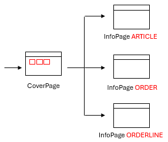
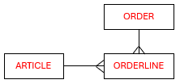
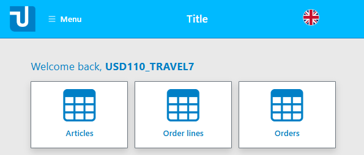
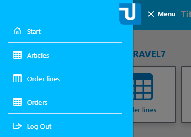
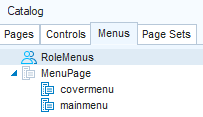

# usoft-zero cover page and menu

## ​Idea

The usoft-zero default gives you a cover page where runtime users land after logging in successfully.

The cover page is the entrypoint to the rest of the application. It contains a tile for each table. The user can click a tile to navigate to what is called an info page for the corresponding table:



These 3 example info pages are available if your data model looks as in the picture below. Only the named tables are necessary. Tables are normally connected by parent-child relationships, as shown, but the relationships do not play a role in the cover page UI:



Here is an impression of a default cover page.



The same functionality offered by the cover page is also offered in a cover menu. This way, the user can navigate to a differrent page anywhere in the default application, not just when s/he is entering the application after login.

Here is an impression of a default cover menu.



## Implementation

In Web Designer, the cover page and cover menu are implemented by classes on the Menus tab of the catalog:



Icons appear by default on each tile in the cover page and on each menu line in the main menu. They are implemented by class settings on the **\<i>** HTML element in the **Prompt (HTML)** property of the MenuLine object in covermenu or mainmenu. For example, icons in tiles on the cover page appear because of this class setting, where "mt-3” is a margin-top setting:

```html
<i class="bi bi-table mt-3"></i>
```

We support Bootstrap icons. You get a circle icon if the class setting contains:

```language-css
bi bi-0-circle
```

Tiles in the cover page and menu lines in the main menus have scripts (property **Script(js**) ) like the following:

```js
$.udb.navigateTo(
  'InfoPage ART_PRODUCT',
  {
    targetFrame: 'ApplicationFrame', 
    quiet:true, 
    newPage:true, 
    applyChanges: false
  }
);
```

For details, go to [$.udb.navigateTo()](/Web_and_app_UIs/UDB_udb/udbnavigateTo.md).

In the example, four options are passed:

|        |        |
|--------|--------|
|targetFrame|Specify this especially when navigating from the menu, otherwise the Page Engine may lose track of the frame.|
|quiet   |Ensures you will get no messages.|
|newPage |This option is necessary. It will clean up the page stack. This is especially relevant if you navigate from a Detail page to some other page.|
|applyChanges|Specify this option just to be sure.|


Use **$.udb.navigateTo** whenever you navigate to an InfoPage. By default, pages of this type have a Back button that will navigate to the cover page. If you specify your own navigation path, make sure the Back button leads back to the page from where you navigated.