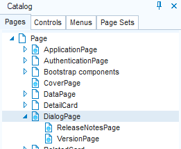
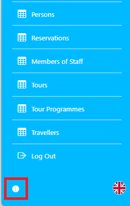

# usoft-zero dialogs

## Dialog pages

The usoft-zero template default comes with a DialogPage class that can be subclassed to achieve custom dialog pages:



DialogPage contains a header, a Close button, a title and a card body. Navigate to a dialog page included in the caller page using:

```js
$.udb.navigateToRelated('*caller-page*', {pageTarget: '*dialog-page*'})
```

## Version page

In usoft-zero, in the standard menu pane, in the far left-bottom corner, an Info icon button is offered as highlighted here in a red rectangle:



Pressing this Info icon button causes a dialog with version information to be displayed:


The information shown in this version dialog is read from a file called:

```
*publication-directory*/assets/version.txt
```

It is assumed that you want to use git tags to indicate the versions. You can generate this information by running a script that extracts the information from Git. Please find a sample script below. The script must be run manually by the developer. You can automate this action in UDeliver.

```language-powershell
#bash

git describe --tags --long --dirty > c:/usoft/alt/website/assets/version.txt

git show -s --format=%cd --date=format:'%Y-%m-%d %H:%M' >> c:/usoft/alt/website/assets/version.txt
```

The following information is offered:

|**Information**|**Description**|**Remark**|
|--------|--------|--------|
|Version |The most recent tag in Git|Is extracted from Git|
|Release date|The date of the tagged commit|Is extracted from Git|
|Commit  |The tagged commit|Is extracted from Git|
|Commits since previous version|The number of commits since the previous version (tagged commit)|Is extracted from Git|
|Dirty   |Indicates whether there are changed files that have not been committed.|Is extracted from Git|
|USoft version|        |        |
|Environment|Development, Test, Acceptance, Production|Is determined on the basis of the database the application is running on.|


‘Commits since previous version' and ‘Dirty’ are meant as a warning to the developer. If they are shown, the version should not be released.

## Release notes page

In usoft-zero, a Release Notes dialog is offered from a hyperlink at the bottom of the version page (previous section of this article). This dialog presents the contents of a markdown file called:

```
*publication-folder*/WebSite/assets/releasenotes.md
```

Keep a copy of this file in your "Alt folder” so that is automatically re-published every time:

```
*alternative-template-folder*/WebSite/assets/releasenotes.md
```

## Delete dialog

In multi-record displays, a Delete button is offered as an icon button that appears immediately to the right of the currently selected record.

By default, clicking this button opens a Delete dialog that warns the user of the delete and offers the option to cancel. This type of dialog is produced programmatically, not by a DialogPage class.

To skip this dialog, find the script line responsible for the Delete button functionality under the **onclickactions** event. This event is defined at the level of the multi-record grid.

Change the script from:

```js
if (element.classList.contains('row-delete')) this.trigger('deletedialogopen');
```

to:

```js
if (element.classList.contains('row-delete')) this.trigger('delete');
```

The two triggers mentioned in these code examples are defined at the top of the Page object.