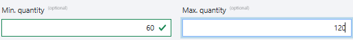
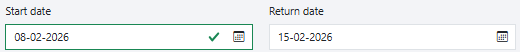
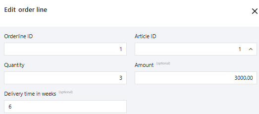
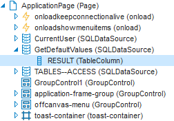

# usoft-zero dynamic defaults

## Ideas

You can have your web page UI react immediately to field values supplied by the user.

“Immediately” is at field validation time. This is the time when the user performs any action implying that she has finished supplying a value in the field. This occurs when she presses the Tab key to navigate to the next field in a form, or clicks any control on the page outside the field.

The web page UI can react by calculating some default value (Examples 1 and 2), by producing some default value looked up in a parent table (Example 3), or by producing a non-blocking warning message (Example 4).

As a developer, you have a number of options.

- You can present the default value as an optional suggestion that the user is allowed to modify: to accept or reject. Or, you can display the produced value as helpful extra information that the user cannot modify. The second is not really a default, but it is still a value calculated dynamically by the web page UI at field validation time.
- You can produce the value or message only initially, when the record is first entered. Or, you can produce a new default value every time the user changes the first value.

Do not confuse with static or “normal” defaults. Implement static defaults in USoft Definer at Domain level, not by using the technology discussed in this article. This article is about “dynamic” defaults in the sense that the web UI produces a *variable* value or message depending on user input in the web page UI. This contrasts with “static” defaults. A static default is the same in all situations, independently of input from the runtime user.

### Dynamic string or number default

*Example 1 - Idea*

The user types a minimum value of ‘60’ in one field. As a default other value, the web UI produces ‘120’ (the double) in another field.



### Dynamic date default

*Example 2 - Idea*

For a time period, the user supplies a start date of 08-02-2026 in one field. As a default end date, the web UI produces 15-02-2026 (1 week later) in another field.



If the user reschedules by changing the start date, the return date can be made to “move along” so that the duration (the gap between the 2 dates) is preserved. Think of an event that has a given duration even if the start date changes, or a meeting that has a given duration even if the meeting time changes.

### Dynamic lookup value

*Example 3 - Idea*

In an orderline, the user selects the article he wants to buy. The web UI produces a default delivery period in another field. This is a look-up action. The user is in the ORDERLINE table. The default delivery period comes from the ARTICLE parent table.



### Dynamic warning message

*Example 4 - Idea*

The user types a Delivery Time in Weeks that is longer than 2 weeks more than the standard delivery time for the article. The web  UI produces a warning message:


This warning is a non-blocking suggestion, as opposed to a blocking error. The user can choose to act upon it, or to ignore it.

Or, the user manipulates purchase amounts in contract lines in a contract. The contrast has a reserved budget for total expenditure. If the user does anything whereby the total purchase amounts exceed this reserved budget, this warning is produced:


:::note

The “dynamic defaults” feature described in this article is the counterpart of [input validation](/Web_and_app_UIs/Web_Designer_controls/Input_validation.md)**.** With dynamic defaults, the web UI reacts to user input by producing a value or a non-blocking message. The focus is on what the UI produces as a reaction to user input. With input validation, the web UI reacts by producing an error: it checks the user input for correctness. The focus is on the user input itself.
Another difference is that input validation is built into USoft. It is always available by default. Dynamic defaults are a feature of the usoft-zero template default. They are only available by default if your web application is based on this template default.

:::

## Implementations

In the usoft-zero template, the feature described in this article is a near-default. You need to perform certain initial actions to get it. These actions are optional. If you do not perform them, the feature is not available.

### Initial actions

Follow these steps to prepare the ground for dynamic defaults.

1. In USoft Definer, from the menu, choose Teamwork, Object Shopping, Import Off-the-Shelf. A dialog window appears. It displays a list of available off-the-shelf components.

2. In the list, find the DYNAMIC_DEFAULTS component. Click on that name. Press the Import Selected button.

This imports a database table called COLUMN_DEFAULT_VALUE and 3 XSL Stylesheet components. If you like, you can find these elements in the Definer catalog and inspect them. Find the table under Model and Rules, Tables, Database Tables. Find the components under Components, Dotnet Components, XSL Stylesheets.

3. Create the COLUMN_DEFAULT_VALUE physical database table.

4. In USoft Web Designer, open the ApplicationPage class from the Pages tab of the catalog.

5. Insert a **SQLDataSource** control into the ApplicationPage class. Do this by dragging a SQLDataSource control from the Controls tab of the catalog (on the left) onto the ApplicationPage node at the top of the object tree (on the right).

6. Right-mouse-click the inserted SQLDataSource object and choose Property Inspector.  Set the object’s Name property to **GetDefaultValues**. Set the object’s SQL property to:

```sql
select dynamic_default_values.apply(
			'<root/>'
		,	'table_name'
		,	:table_name
		,	'old_values'
		,	:old_values
		,	'new_values'
		,	:new_values
		)

```

7. Insert a **TableColumn** control into the inserted SQLDataSource class. Do this by dragging a TableColumn control from the Controls tab of the catalog (on the left) onto the “GetDefaultValues(SQLDataSource)” node in the object tree (on the right). Call this inserted TableColumn **RESULT**. Do this in the Property Inspector by setting the TableColumn’s Name property to: RESULT.

Your object tree should now look something like this. Compare this to your work. Check the ApplicationPage, GetDefaultValues, and RESULT nodes.



8. In Definer and Authorizer, make sure that all intended runtime users have SELECT rights on the COLUMN_DEFAULT_VALUE table.

### Defining the behaviour

Now define exactly how your dynamic default behaviour should work. Do this by populating the COLUMN_DEFAULT_VALUE table in the User Application. The resulting behaviour is immediately available in the web page UI. You do not need to re-publish.

You can only define 1 dynamic default behaviour for each given column. COLUMN_DEFAULT_VALUE has a primary key across columns (TABLE_NAME, COLUMN_NAME).

You express what you want by specifying a SQL statement in the DEFAULT_VALUE_SQL column.

- This must be a SELECT statement.
- This statement must select 1 output column.
- This output column must have alias “RESULT”.
- This statement will be processed by the Rules Engine. You can write any USoft-processable SQL.
- This statement can contain *host variables.* A host variable is represented by a colon followed by an all-caps column name:

```sql
:COLUMN_A
```

Just before the statement is executed, each host variable will be substituted by the current row value for the column referenced. The substituted value is the value as displayed to the runtime user in the form in the UI.

By default, the substituted value is always seen as a **string** value, even if the Rules Engine sees it as a number, date or boolean. You are free to convert the values by means of conversion functions that are available in SQL. If the field is empty, the substituted value is the empty string. Use IS NULL and IS NOT NULL comparison operators in SQL to detect or exclude empty strings:

```sql
:COLUMN_A is null /* true if the field is empty */
```

In USoft transitive constraints, an OLD() function is available for getting the column value just before it changed. In dynamic default SQL, an **OLD_** prefix is available for this purpose (notice the underscore). This prefix is interposed in host variable references between the colon and the column name:

```sql
:OLD_COLUMN_A
```

By default, the behaviour is triggered by any change in the columns involved. This is not always what you want. By adding conditions with the **OLD_** prefix you can make sure it is triggered only when you want it.


:::warning

The advantage of having dynamic default SQL as application data in the User Application, as opposed to development-time data in Definer or Web Designer, is that any change becomes immediately available. You do not need to re-publish.
The drawback is that the SQL is not checked for correctness. All errors are runtime errors. If you change table names or column names in Definer, USoft will not notice the old names are still used in dynamic default SQL.

:::

###  Dynamic string or number default

*Example 1 - Implementations*

The user types ‘60’ in the Minimum Quantity field. The web UI produces ‘120’ (the double) in the Maximum quantity field.

Each time the user sets or changes the min value, the max value is set or reset to the double of the (new) min value. When the user sets or changes the max value, this does not affect the min value.


This is implemented by adding the following record to the COLUMN_DEFAULT_VALUE table :

Table: ORDERLINE

Column: MAX_QUANTITY

SQL:

```sql
select  :MIN_QUANTITY * 2 	"RESULT"
```

If you want this behaviour only initially, ie., when the record is first introduced, write:

SQL:

```sql
select  :MIN_QUANTITY * 2 	"RESULT"
where   :OLD_SEQNO is null

```

The WHERE condition detects whether the record is new because SEQNO is the primary key.

If you want to add the behaviour that the max value is erased when the min value is erased, write:

SQL:

```sql
select decode
   (
	:MIN_VALUE
   ,   null
   ,   null
   ,   :MIN_VALUE * 2 ) 	"RESULT"

```

### Dynamic date default

*Example 2 - Implementations*

The user types a start date for a tour in a travel agency. The web UI produces a default return date (the end date of the period), 1 week later than the start date input by the user.


Each time the user sets or changes the start date, the return date is set to 1 week later. When the user sets or changes the return date, this does not affect the start date.

This is implemented by adding the following record to the COLUMN_DEFAULT_VALUE table :

Table: TOUR

Column: RETURN_DATE

SQL:

```sql
select   usformat.datetochar( 
           usformat.chartodate(
              :START_DATE
           ,  'DD-MM-YYYY' 
           ) + 7
         , 'DD-MM-YYYY' 
         )    "RESULT"

```

This behaviour comes down to suggesting a duration of 1 week.  You may want this only for *new* cases. For other cases, where the 2 dates already exist, you may want to preserve the existing duration (the existing gap between the 2 dates) if the start date changes.

If you want this, write:

```sql
select   usformat.datetochar( 
           usformat.chartodate( :START_DATE,  'YYYY-MM-DD' ) + 
            (
              usformat.chartodate( :OLD_END_DATE, 'YYYY-MM-DD' ) -
              usformat.chartodate( :OLD_START_DATE, 'YYYY-MM-DD' )
            )
         ,  'YYYY-MM-DD'
         )    "RESULT"
where    :OLD_START_DATE is not null
and      :END_DATE = :OLD_END_DATE
union
select   usformat.datetochar( 
           usformat.chartodate(
              :START_DATE
           ,  'YYYY-MM-DD' 
           ) + 7
         , 'YYYY-MM-DD' 
         )    "RESULT"		
where    :OLD_START_DATE IS NULL

```

You need the UNION operator because there is only room for 1 SQL statement, and you want to specify 2 different behaviours.

You need the WHERE clauses for :OLD_START_DATE to make sure that either the part before UNION or the part after UNION is applied, not both.

You need the additional WHERE clause for :END_DATE (just before the UNION keyword) in order to prevent the default from being enforced if the runtime user changes the duration by editing the end date manually.

### Dynamic lookup value

*Example 3 - Implementation*

In an orderline, the user selects the article he wants to buy. The web UI produces the default delivery period for the article in another field. This is a look-up action. The user is in the ORDERLINE table. The default delivery period comes from the ARTICLE parent table.


This is implemented by adding the following record to the COLUMN_DEFAULT_VALUE table :

Table: ORDERLINE

Column: DELIVERY_TIME

SQL:

```sql
select  delivery_time  "RESULT"
from    article
where   article_id = :ARTICLE_ID

```

### Dynamic warning message

*Example 4 - Implementation*

The user types a Delivery Time in Weeks that is longer than 2 weeks more than the standard delivery time for the article. The web  UI produces a warning message:


This is implemented by adding the following record to the COLUMN_DEFAULT_VALUE table:

Table: ORDERLINE

Column: DELIVERY_TIME

SQL:

```sql
select '' RESULT
where 1 =
(
	INVOKE  rulesEngine.messageLanguage WITH
	SELECT  'USoft Message'
	,       'REPORT'
	,       'WARNING'
	,       'Delivery time is more than 2 weeks longer than standard.'
	from    article a
	where   a.article_id = :ARTICLE_ID
	and     :DELIVERY_TIME > a.delivery_time + 2
)

```

Or, the user manipulates purchase amounts in contract lines in a contract. The contrast has a reserved budget for total expenditure. If the user does anything whereby the total purchase amounts exceed the reserved budget, this warning is produced:


Table: CONTRACT_LINE

Column: PURCHASE_AMOUNT

Message: PCL_NOTIFICATION

Total purchase amount exceeds reserved budget.

As a declared message in USoft Definer, you can provide translations of this message.

SQL:

```sql
select	'' RESULT
where	1 =
(    invoke	rulesengine.messagelanguage with 
     select  'Custom Message' 
     ,       'PCL_NOTIFICATION' 
     ,       'WARNING' 
     where exists
     (
         select    ''
         from      contract c
         where     c.reserved_budget <
         (
               select  sum( l.purchase_amount ) + 
                       convert( int, :PURCHASE_AMOUNT )
               from    contract_line l
               relate  c HAS l
               where   l.contract_line_id != :CONTRACT_LINE_ID
         )
         and       c.contract_id = :CONTRACT_ID
     )
     and
     (
           (          :OLD_PURCHASE_AMOUNT is null
                and   :PURCHASE_AMOUNT is not null
           )
           or
           (
                      :OLD_PURCHASE_AMOUNT is not null
                and   :PURCHASE_AMOUNT is null
           )
           or         :PURCHASE_AMOUNT <> :OLD_PURCHASE_AMOUNT
     )
)

```

In the summation (the most-nested subselect in the statement) you query from a second instance of the table being modified. You need to exclude the record of the host variable from the query, and manually add the host variable value to the summation.