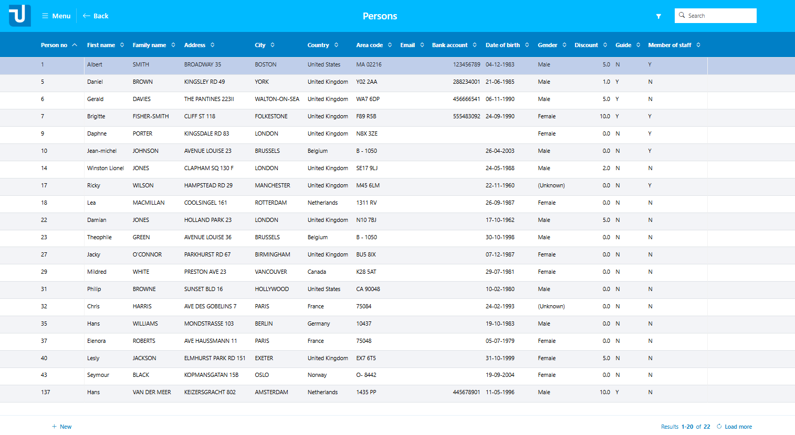

# usoft-zero multi-record grids

The usoft-zero default presents table data in a **multi-record grid** in InfoPages, DetailPages and RelatedCard classes.

This article contains tips for customising a number of features of default multi-record grids.

Here is an impression of a default multi-record grid for an InfoPage on table PERSON:

## Search

The white Search field shown here in the top-right corner is not a default, but a near-default. You need to do a little manual work in Web Designer to get a near-default to work. For details, go to [usoft-zero search](/Web_and_app_UIs/USoft_template_defaults/usoftzero_search.md).

## Horizontal alignment and stickyness

By default, as the example shows, numeric values are right-aligned except for the first column in the table. To change, in Web Designer, set the **Horizontal Alignment** property for the GridCellControl for the column.

By default, the leftmost column is "sticky”. If the user reduces the width of the browser window, and then scrolls horizontally to the right to see the last columns, the first column remains in view.

## Drag-and-drop sorting

### Idea

In some situations, you want to be able to order records in the grid by dragging the records to the correct position. This section describes how to implement this.

The solution revolves around one column being the **sort column** of your multi-record view. When you start dragging, the value in the sort column will be changed in such a way that each row in your multi-record view will get a sequence number starting with 1. The sort column is any column of your choice. The column is part of the application and must be of a data type that accepts numbers.

### Implementation

**1. Sort column**

Make sure that the underlying table has a sort column. This column must be of a numeric data type. Its data will be determined by the row dragging mechanism in the web page UI. The sort column is not necessarily (and perhaps: not typically) displayed, but it could be displayed.

**2. Data source**

In Web Designer, make sure that the sort column is a TableColumn in the data source that underlies the multi-record grid. For the TableColumn, set the “Sort Order” property to Ascending. Make sure other columns in the data source are **not** part of the sort order, ie., that they have “Sort Order“ = None (the default).

**3. dragsortGridCellControl**

In Web Designer, in the Controls tab of the catalog, find the **dragsortGridCellControl** under InputControl/GridCellControl/dragsortGridCellControl.

Drag this control onto the **GridEditControl** object in your page.

**4. Data Source Item**

On the control inserted in Step 3, set the Data Source Item. Choose the sort column from Step 1. Be aware that the data in this column will be overwritten when you start dragging rows in the application. These data changes are implicitly committed.

**5. Sort headers**

For all your GridCellControls, set ‘Enable sorting in header' = 'No’.

## Buttons

Only for the record currently hovered, by default, a set of **icon buttons** is displayed to the right of the table data. These icon buttons could look like this (with, in this case, the leftmost icon hovered, so that its name is displayed):

In the picture, the icons shown are for Edit, Copy, Duplicate and Details.

In addition to the icon buttons, a push button for New is displayed below the grid:

### Visibility

Buttons will only show if the user has the rights on the table for the action and the data source allows the action.

The “Edit“ button will not show if the user has no Update Rights on the table, or the data source is not editable.

The “Duplicate“ and “New“ buttons will not appear if the user has no Insert Rights on the table, or the data source is not insertable.

The “Delete“ button will not appear if the user has no Delete Rights on the table, or the data source is not deletable.

### Moving buttons to the footer

If you do not like the on-hover icon buttons, you can replace them by push buttons in the footer.

Edit the “Class List” property of:

- InfoPage

- RelatedCard

And remove these classes:

- edit-button-on-row

- duplicate-button-on-row

- delete-button-on-row

Now, the Edit, Duplicate and Delete button will no longer display as on-hover icon buttons at record level. Instead, they will display in the footer below the grid.

### Details button for related cards

By default, a related card has no Details button. To include a Detail button:

- Add the class “goto-detail-button-on-row“ to the related card.

If “goto-detail-button-on-row” is specified, then double-clicking on a row will bring you to the Details page.