# usoft-zero tabs

This article describes tab controls that USoft delivers as a near-default in the **usoft-zero** template default for browser-based UIs. This **usoft-zero** UI/UX is the default that USoft delivers by default.

A near-default is a feature that is not in the default but that you can introduce at low cost.

## Multi-record tab cards for child data

### Idea

In your data model, there is a PERSON table with relationships to 2 children: RESERVATION and TRAVELLER:

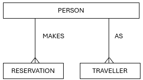

On this basis, you get a detail page for PERSON with 2 grid controls, one for Reservations made by the Person, and another for cases where this person appears as Traveller:

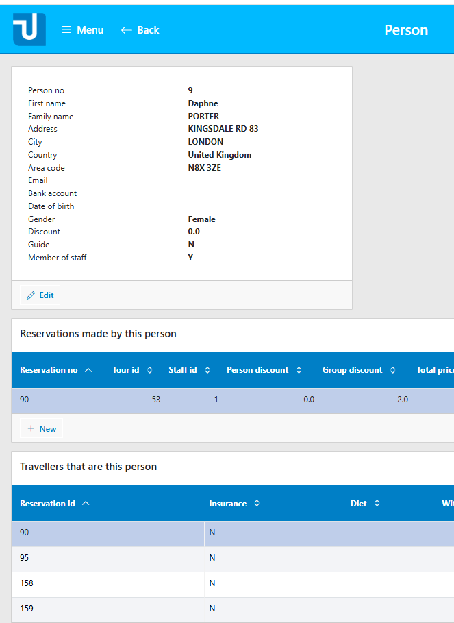

You decide you want to bring these 2 grids under a single Tab control with 2 tabs, one for each child table:

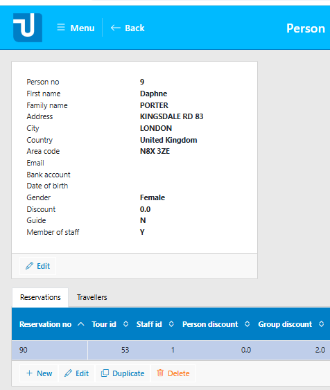

### Implementation

A tab control with tab pages and grids for all the child pages of table PERSON is implemented as a near-default in a class named TabCardRelateds PERSON. Find this class on the Tables tab of the Web Designer catalog:

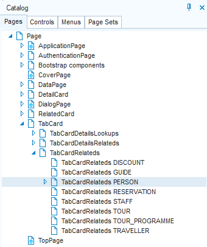

To replace the default blocks with grids by the tab solution, first locate the default grids in the DetailPage class:

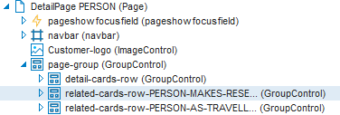

As you can see, they are GroupControls named **related-cards-row…**

Delete the 2 **related-cards-row…** GroupControls (right-mouse-click, Delete). Add the “TabCardsRelated PERSON” class by dragging it from the Web Designer catalog on the left onto the **page-group** node in the object tree on the right:

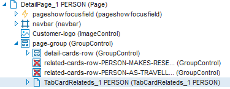

:::note

In the solution shown, first a subclass was created of the “TabCardRelateds PERSON” class. This subclass was named “TabCardRelateds_1 PERSON”. As a next step, an instance of this subclass was dragged onto the detail page.
This is good practice. The advantage of working with a subclass in a customised solution is that the “unpainted” default TabCardRelateds superclass remains available for later re-use and repeated subclassing.

:::

## Single-record tab cards for parent data

### Idea

In your data model, there is a TOUR table with a relationship to a RESERVATION child table (reservations are made for tours).

The TOUR table also has relationships to 2 parent tables: TOUR_PROGRAMME (tours follow tour programmes) and PERSON (persons guide tours).

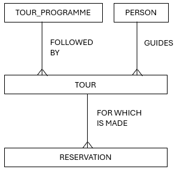

In the usoft-zero default, by default, each detail page for TOUR has a top pane for viewing all the information of the current tour, and a bottom pane with a grid showing the reservations made for the tour:

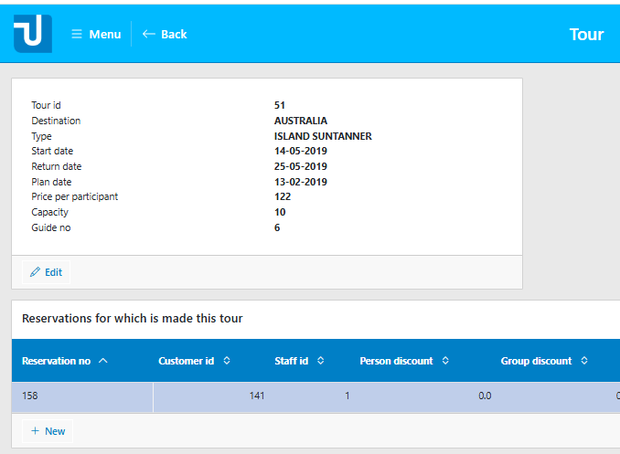

But the top page does not give any information about the parents, just the foreign key values (for example, Guide no. = 6).

You decide that as an extra service to the user, detailed information about the guide parents and the tour programme parents must be offered in a second top page. The 2 parents are shown on 2 tab pages of a tab control:

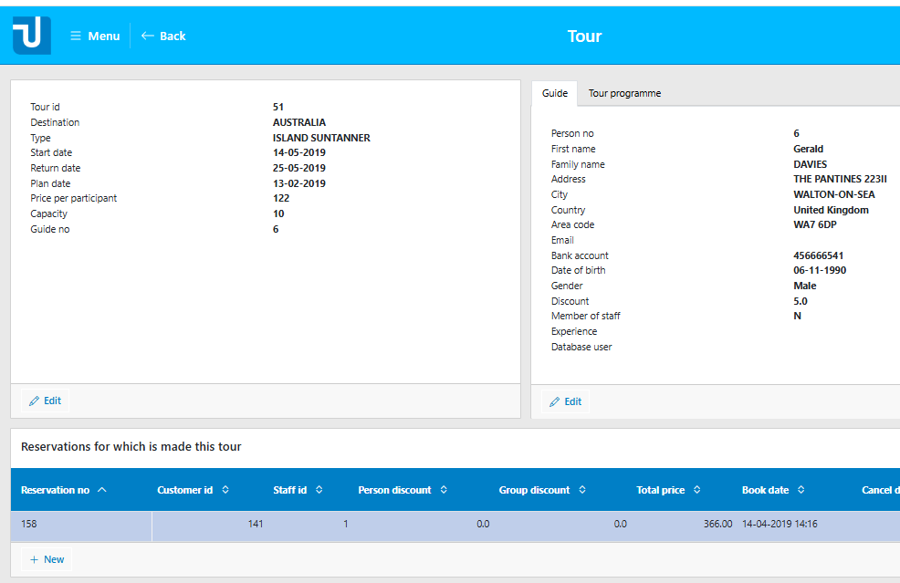

### Implementation

The tab solution for showing parent information for all the parents of table TOUR is implemented as a near-default in a class called TabCardDetailsLookups TOUR. Find this class on the Pages tab of the Web Designer catalog:

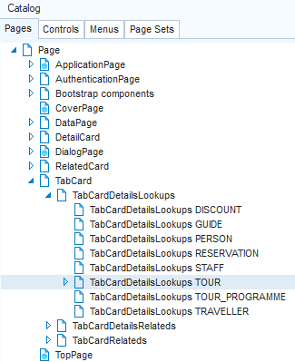

In the default detail page, see that the top pane has been implemented by a DetailCard TOUR class dragged into an object called **detail-cards-row**:

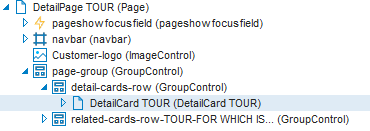

To get the added tab page with the parent information on 2 tabs, all you need to do is to also insert a “TabCardDetailsLookups TOUR” class into this **detail-cards-row** object. Do this by dragging this class from the Web Designer catalog on the left onto the **detail-cards-row** node in the object tree on the right. To finish, make sure that the tab solution comes second, not first. Do this by making sure that the Position property of the DetailCard object is set to a lower number than the Position of the inserted TabCardDetailsLookups.

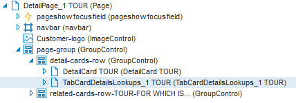

## Single-record tab cards for child or subtype data

### Idea

This is the same idea as the single-record tab cards for parent data just discussed, except that the additional data you provide does not come from a parent table but from a child or subtype table.

This idea is applied much less frequently, for the simple reason that most relationships between entities are 1-to-many parent-child relationships. Naturally, in most cases, if you add information about a parent, you need a single-record display, and if you add information about children, you need a multi-record display.

This idea can work if you have a 1-to-1 relationship to a child or a subtype. As an example, consider loan requests that may or may not lead to loan contracts. Each loan contract is based on a loan request, but not each loan request leads to a contract. Some data are necessarily collected during the request phase. If it comes to a contract, optional contract details are added in a later phase. In USoft Definer, model this as a parent-child relationships with Max Children = 1, or as a subtype, for example in one of these ways:

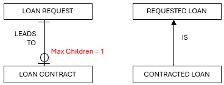

### Implementation

This is implemented in a similar way as single-record tab cards for parents (previous section), except that you need to select a class named "TabCardDetails**Relateds**” instead of "TabCardDetailsLookups”. Find such a class on the Pages tab of the Web Designer catalog:

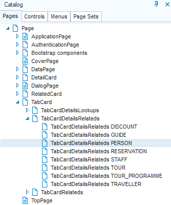

 