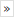
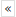

# nextDataSet, previousDataSet

**See also**

- [Web Benchmark recordable actions](/Web_and_app_UIs/Web_Benchmark_recordable_actions)

The **nextDataSet** recordable action in Web Benchmark is a click on the nextDataSet icon of a DataSetNumbersControl:

The **previousDataSet** recordable action in Web Benchmark is a click on the previousDataSet icon of a DataSetNumbersControl:

For these recordable actions, the following [generic target control properties](/Web_and_app_UIs/Testing_your_web_application_with_USoft_Web_Benchmark/Web_Benchmark_test_editing_Identifying_target_controls_and_their_properties.md) are in scope: Occurrence rank, Source Frame.

In addition, the following property is also in scope:

|**Property**|**Editable?**|**Explanation**|
|--------|--------|--------|
|Reference name|Yes     |The **id** attribute value of the DataSetNumbersControl that was clicked.|

 