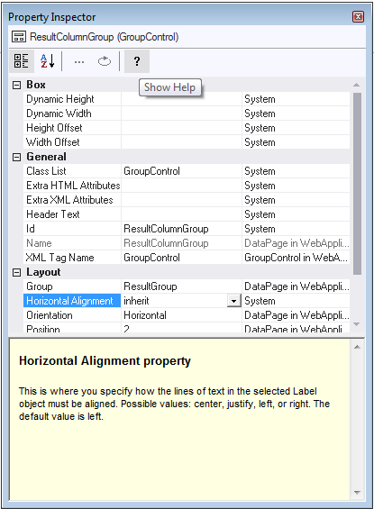

# How to access Web Designer property help

Help is offered in a bottom pane inside the Property Inspector on each individual property that you can set for an object.

To access Web Designer Property Help for a specific property of a specific object (page, control):

1. Open the Property Inspector for the object.

2. Click on the property that you want help about.

3. If the Help text is not visible at the bottom of the Property Inspector, toggle the "Show Help" button in the icon button menu across the top of the Property Inspector:

Help is offered in a bottom pane inside the Property Inspector on each individual property that you can set for an object.