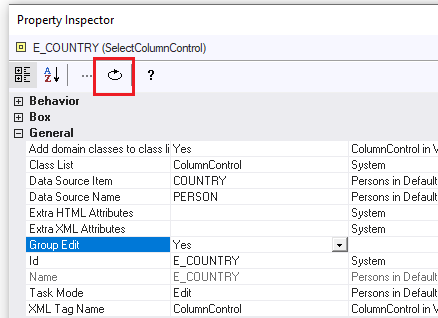

# How to reset properties

Re-inheritance is an efficient way of limiting the total number of settings for a particular application. The fewer local settings there are, the more efficient the maintenance of your web application will be. To this end, you can use the Reset button on the Property Inspector to reset a property's value to the value as defined for the object's superclass. In other words, the higher up in the hierarchy you define settings, the fewer settings there are, and the more efficient development and maintenance will be.

For example, if you want to change the Orientation property for a group object back from Vertical to Horizontal (the default value), then it is better to use the Reset button than to change the setting manually.

To reset a property:

1. In the Property Inspector, click the property that you want to reset to the initial value.

2. Click the Reset button, or click the right mouse button, and then choose Reset (the Reset button is highlighted by a red border in the picture):

Reset button

:::caution

You can only reset a property value which has previously been set locally (that is, at the object class level you are currently viewing). In other cases, the Reset button is insensitive.

:::

*Explanation*

A property value is either a local setting, or it is being inherited by a different object class higher up in the hierarchy:

- If the property value has been set locally, the 3rd column in the Property Inspector is EMPTY and the Reset button is sensitive (= can be pressed).

- If the property value is being inherited by a different object class higher up in the object hierarchy, this object class is displayed in the 3rd column and the Reset button is insensitive.

Resetting a property value means that a local property setting reverts to being an inherited value. In the picture, the Reset button is sensitive because the currently selected Group Edit property value has been set locally for the E_COUNTRY SelectColumnControl object class displayed at the very top of the Property Inspector. The Group Edit property has no displayed value in the 3rd column. This indicates that its setting is local and may be reset.

 