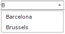
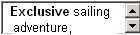
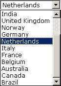

# Input controls by type

This help topic discusses input controls by type.

### AutoComplete control

An **AutoComplete** control, like a Select control, is a dropdown box that shows available values from which the user can choose. Unlike the Select control, it has auto-reduce behavior: if the user types characters in the box, the list of available values is limited to the values that match the typed characters. In this example, from a list of cities, only cities starting with 'B' are shown, because this letter has been typed in the box:

AutoComplete controlAutoComplete controls are appropriate for fields tied to closed sets of allowed values. Typically, this closed set of values comes either from the Allowed Values of the underlying domain (values enumerated in USoft Definer) OR from records in a parent table. In the latter case, in Web Designer, a lookup data source is used to relate the parent table to the field.

You can control how many values will be shown in the list at any one time by setting the **Maximum Choices to Display** property of the AutoCompleteInputControl, but this property is available only if you create your own column control, not if you have reset an existing column control's Type to 'autocomplete'.

### Checkbox control

A  **Checkbox** control allows the user to check or uncheck an option to express that it applies or does not apply:

Checkbox controlAs a designer, you need to determine whether (in addition to Yes or No) it is possible to leave the choice open (undefined). Also, you need to determine what is the default value for the checkbox.

If the checkbox column controls is not based on a Yes/No domain (defined in USoft Definer), you will need to add Yes/No options to the control (note that the negative option must be first). It is preferable to define a variable data source, add your options and defaults to items in that data source, and connect the Check Box column control to the data source.

### HTML area control

An **HTML Area** control is a multi-line text box suitable for descriptions or other narrative text (as opposed to structured data):

HTML area controlImage control

An **Image** control is a picture: a drawing, symbol, photo or animated picture that is part of your application. An image may be structured data in the sense of being stored in a database column and retrieved as part of a record. However, more often an image is a static element retrieved from file.

### Password control

A  **Password** control is a Text control that does not echo typed characters on the screen but, instead, displays a bullet for each typed character:

Password controlRadio control

A  **Radio** control is a group of round selection buttons:

Radio controlIn a group of radio buttons, there is always 1 selected button: if the user presses (selects) one button, all the other buttons are unselected.

Radio controls are suitable for fields that have a very limited set of allowed values (2-5). Typically, a value is mandatory. If the user is allowed not to choose, best practice is to invent a value that represents this, for example, '(None)'.

### Select control

A  **Select** control is a dropdown box that shows available values from which the user can choose:

Select controlSelect controls are suitable especially for fields that have a limited number of allowed values (5-20). Typically, this closed set of values comes either from the Allowed Values of the underlying domain (values enumerated in USoft Definer) OR from records in a parent table. In the latter case, in Web Designer, a lookup data source is used to relate the parent table to the field.

If you want allowed values that are unrelated to the database, define a variable data source, add your options and defaults to the variable, and connect the Select control to this data source.

Consider whether you want to offer an AutoReduce control or a Select control.

### TextArea control

An **TextArea** control is a multi-line text box suitable for descriptions or other narrative text (as opposed to structured data):

TextArea control### Text control

A  **Text** control is a single-line text box:

Text control 

Text controls are suitable for fields that contain structured data, especially text strings or numbers.