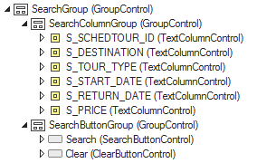

# Layout areas

**Layout areas** are sections of web pages that have a specific purpose within the page. Often, they are rectangular areas that are visually marked out from surrounding areas.

In a USoft context, the most significant layout areas are SearchGroups, GridGroups and SingleRecordResultGroups. Here is an example of a SearchGroup in the object tree of a USoft default application. It offers 6 fields for entering search conditions for data stored in 6 database columns. It also offers a Search button and a Clear button:

A layout area is either **single-record** or **multi-record:**

- In a single-record area, you see the values of a single record in a group of fields. Each field maps to a database column.
- In a multi-record area, you see a **grid** (or spreadsheet). Each grid row maps to a database record. Each grid column maps to a database column.

But in the USoft default application, records are also split across multiple layout areas, because key columns are in different areas than non-key columns:

- In **key column areas**, only key columns (columns where Key = 1, 2, ...) are displayed.
- In **non-key column are****a****s**, only non-key columns (columns where Key = No) are displayed.

Finally, in the USoft default application, the arrangement of layout areas also depends on whether you are in an info page, a lookup page, or a related page. A summary of default layout area arrangement is:

|**Key column areas**|**Non-key column areas**|
|--------|--------|
|
Info Page: Search area.

Info Page: Multi-record result grid.

Lookup Page: Search area.

Lookup Page: Multi-record result grid.

Related Page: Single-record area (for parent data).

Related Page: Multi-record result grid (for child data).
|
Info Page: Single-record result block.

Lookup Page: Single-record result block.

Related Page: Single-record block (for child data).
|

This default arrangement only applies to tables where ALL columns have the In Display Selection set to NULL (the default). In other words, developers can override the default rules in USoft Definer by setting the "In Display Selection" (former "In Lookup") column attribute.

The "In Display Selection" attribute allows developers to influence the default rules declaratively from USoft Definer.

For each table, the default arrangement is changed if at least one of the columns within the table, or within a supertype table of the table, has a (numerical) value for "In Display Selection" (the default being NULL). In this case, a different arrangement applies:

- Columns that have a value for "In Display Selection" are shown by default in all key column areas, in the order indicated by the (numerical) values of "In Display Selection".
- Columns that do NOT have a value for "In Display Selection" are shown by default in the non-key column areas, in the order indicated by their Position attribute.

Some consequences of the default arrangement are:

- In result areas, by default, if a column is not displayed in the multi-record area (on the left-hand side) then it is displayed in the synchronized single-record area (on the right-hand side); this is true whether or not developers have set values for In Display Selection.
- Developers can use In Display Selection to move a column from one area to the other.

The default arrangement, and also the default created by using In Display Selection, can of course be overridden or further developed by Web Designer settings.

Summary:

|**"In Display Selection" column attribute**|**Result**|
|--------|--------|
|NULL for all columns within the base table and its supertype table(s) (the default).|In search areas, multi-record result areas and parent areas, only primary key and other key columns (i.e. where Key = 1,2,...) are shown (ordered by Position)In single-record result areas, all other columns are shown (ordered by Position).|
|(Numerical) value for at least 1 column within the base table, or within a supertype table of the base table.|In search areas, multi-record result areas and parent areas, columns with an "In Display Selection" value are shown (ordered by the In Display Selection attribute).In single-record result areas, all other columns are shown (ordered by Position)|

 