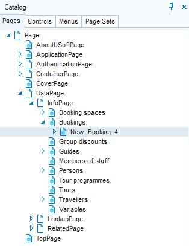

# Page classes

In Web Designer, a *page class* is the definition of a browser page in a USoft web application. A page based on a page class can be *published* to a web service and thus be made available to your end users. They navigate to a page in different ways, for example by selecting a main menu option, or by clicking a hyperlink in a different page.

:::note

Page classes enable you simply to create-and-publish browsable pages quickly. But they can also be the basis of web parts that you embed in surrounding other pages, and they can also be the (abstract) basis of (concrete) multiple end-user pages that share characteristics defined at the more abstract level.

:::

At development time, page classes are visible in the **Pages catalog** on the left-hand side of the Web Designer tool interface.

Pages catalogAs the picture shows, pages are organised in a class inheritance hierarchy. Lower-level pages inherit objects and properties from higher-level parents. The picture also shows a set of *default InfoPage* classes: they are the children of the InfoPage node. As a low-code environment, for each table in your data model, USoft automatically creates an InfoPage class that you can publish instantly.

:::warning

If you change the data model (in USoft Definer), you must restart Web Designer to see the effect on the list of generated InfoPages.

:::

USoft also automatically creates LookupPage and RelatedPage classes. This happens on the basis of Relationships in your data model.

You can create *user-defined classes* by right-clicking on a node in the catalog and choosing New. As a next step, right-click on the newly created node and choose Rename. In the picture, "New_booking_4” is a user-defined variant of the default-generated Bookings page.

:::tip

USoft creates a fully functional default web application for you that gives you default access to pages for all tables in your data model. It is good practice to leave the default alone so that you can always fall back on it, even after you have created custom implementations of your own. For more on this practice, see Tip 1 in [this](/docs/Web_and_app_UIs/Web_menus/Web_menus_Quick_Start.md) article.

:::
