# Chart controls

**Chart controls** and their associated **chart data controls** can be found under the Controls tab of the Controls Tree.

Chart controls present data in an appealing graphical format, for example in a bar chart, a line chart, or a pie chart.

:::note

For visual examples of chart controls, scroll further down.

:::

When data in the underlying data sources change, these changes will reflect in the chart controls.

To create a chart control, you need:

- a ChartControl for the chart itself,
- a ChartDataControl for each set of data to be displayed (some types of chart require more than one),
- TableDataSources that hold the chart column data.

:::tip

**ChartControl** and **ChartDataControl** are explained in the next sections of this article.

:::

Here are the general steps for creating a chart control in USoft Web Designer.

1. Insert a ChartControl object from the Controls tab of the catalog. Find the ChartControl control class by expanding the DataControl class on the Controls tab of the Web Designer catalog.

2. Insert one or more ChartDataControls for each set of data to be displayed by the ChartControl.

3. Add a Table Data Source that contains the data to be displayed. Set its ‘Initial State’ property to ‘Query Records’, so that it is queried when the Chart Control is viewed.

4. Set the ‘Data Source Name’ property of the Chart Control and the Chart Data Controls to the data source you have just added.

5. Set the ‘X-Axis Column’ property to the table column that will deliver the values for the Horizontal axis of the chart.

6. Set the ‘Main Chart Type’ of the Chart Control to the type of chart to be displayed. Or, if a mixed chart type is to be used, set the ‘Chart Type’ property for each Chart Data Control. The different types of charts (including the amount of Chart Data Controls needed for each data set) is explained in the Chart Control section.

7. For each Chart Data Control, set the ‘Data Source Item’ property to the columns that represent the data that must be displayed.

8. Set the ‘Color’ property for each Chart Data Control if a different color than the defaults is desired.

9. Set the ‘Chart title’ and ‘Chart subtitle’ to give the Chart Control a name. These titles are displayed at the top of the chart.

## ChartControl

You can find the ChartControl control class in Web Designer’s Controls Catalog as a child of DataControl:

ChartControl is a DataControl: it can contain data source information, i.e. references to data sources on the page, and their columns.

ChartControl acts as the holder of a graphical chart and contains most of its properties. ChartControl can only contain ChartDataControls and EventListeners.

ChartControl uses a third-party library called Apex Charts, which contains extensive support for more than a dozen types of different charts. The documentation of this third-party library can be found at:

[https://apexcharts.com/docs/](https://apexcharts.com/docs/)

In a ChartControl, you define the main properties of the chart, such as the column containing the x-axis data labels, the chart titles, and the chart type. Open the Property Inspector on ChartControl to inspect properties. Click on a property name and read the explanation in the Help tile (yellow background).

:::tip

If you do not see Help text, click the ‘?’ icon in the icon ribbon near the top of the Property Inspector.

:::

### Events

There are three events that add extra behavior to a Chart Control:

|**Event**|**Description**|
|--------|--------|
|click   |Adds a click event on the data points of the Chart Control. While clicking on them already has the effect of selecting the associated record in the data source, this click event enables additional behavior.|
|chartoptions|
Replaces the generated option values of the Chart Control with different ones. This allows modification of default behavior and adding additional effects such as annotations and trend lines. This event supercedes the ‘Extra Plot Options’ property in most cases.

For advanced usage only.
|
|chartdata|
Replaces the data retrieval from data sources and allows adding data from external data sources, such as REST URI’s. The data needs to be formatted manually in the appropriate structure that the ApexChart library understands.

For advanced usage only
|

## ChartDataControl

You can find the ChartDataControl control class in Web Designer’s Controls Catalog as a child of DataControl:

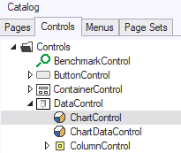

Open the Property Inspector on ChartDataControl to inspect properties. Click on a property name and read the explanation in the Help tile (yellow background).

:::tip

If you do not see Help text, click the ‘?’ icon in the icon ribbon near the top of the Property Inspector.

:::

### Combining multiple ChartDataControls into a data set

Normally one Chart Data Control represents one set of data for a Chart Control. However, several Chart types require multiple columns of data for their representation, and therefore multiple Chart Data Controls must be linked together for this purpose. To combine multiple Chart Data Controls to form one data set, you must:

1. Set the ‘Chart Type’ property of these Chart Data Controls to the same value, or set the ‘Main Chart Type’ to the correct type.

2. Set the ‘Series Name’ property for each of these Chart Data Controls to the same value.

3. The controls that you want to combine must be in consecutive order, i.e. no other Chart Data Controls with a different ‘Series Name’ value may be interposed between them.

4. If more data sets are needed, repeat Steps 1-3, but use a different (new) name in Step 2.

Typical chart types that require multiple Chart Data Controls are:

- Scatter and Heatmap, which require two controls. One for the X position and one for the Y position of the data point. For obvious reasons, the Scatter chart typically requires both data source items to be of a numeric value type.
- Time Line, which requires two controls. One for the starting time position and one for the ending time position of the data point. For obvious reasons, this chart type typically requires both data source items to be of value type ‘Date’, although it is also possible to just use a numeric column.

## Chart types

With the term ‘data set’ we refer to the column specified in the ChartDataControl that contains the data to be displayed. Most charts require 1 ChartDataControl per data set, some however require two or even more. Combining more Chart Data Controls to one data set is done by setting the same ‘Series Name’ to several consecutive Chart Data Controls. See the ChartDataControl section for more information.

Various chart types are supported by the Chart Control. Some can be mixed together in one chart, i.e. the Area, Bar and Line chart types. In this case, the Chart Type property of the Chart Control should be used to determine the chart type of each data set, otherwise just using the ‘Main Chart Type’ of the Chart Control suffices.

Here are some chart types.

### Line chart

Can be mixed with Area and Bar chart. Multiple data sets allowed by using multiple Chart Data Controls. Data can be stacked as well.

*Example 1*

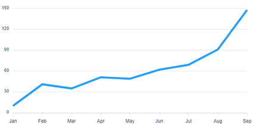

*Example 2*

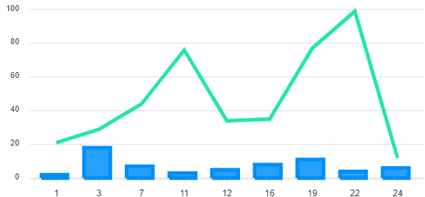

### Area chart

Can be mixed with Line and Bar chart. Multiple data sets allowed by using multiple Chart Data Controls. Data can be stacked as well.

*Example*

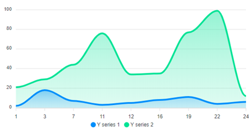

### Bar chart

Can be mixed with Area and Line chart. Multiple data sets are allowed by using multiple Chart Data Controls. Data can be stacked as well. If Orientation property is set to ‘Horizontal’, the X and Y axis are swapped and the bars are drawn horizontally. If stacking is used and negative values exist, then these are drawn in both directions.

*Example*

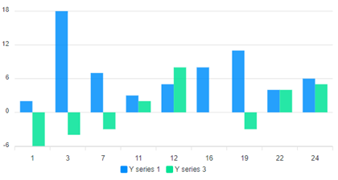

### Pie chart

A pie chart only requires and supports a single data series. Therefore only the first Chart Data Control is used, even if several are specified.

*Example*

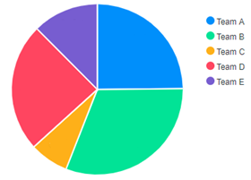

Here are some variations on the pie chart. This is a **donut chart**:

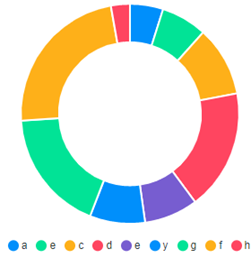

This is a **radial bar chart**:

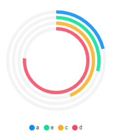

### Scatter chart

A scatter chart requires two Chart Data Controls per data set.

*Example*

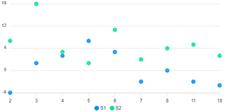

The first Chart Data Control defines the X value, the second defines the Y value. Both controls therefore have the same Series Name property value:

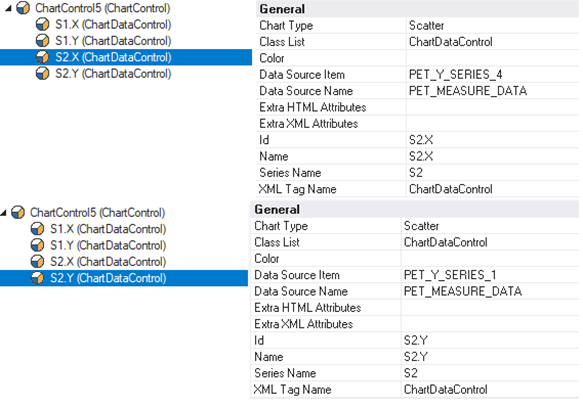

**Radar chart**

Radar charts may have multiple data sets, one per Chart Data Control. Negative values can be rendered too (and are rendered as the inner parts of the radar figure). The X-Axis labels are rendered at the outer edges.

*Example*

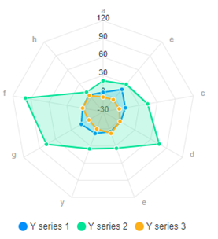

### Heat map chart

Heat map charts are rendered line per line alongside the Y-Axis, one data series at a time.

*Example*

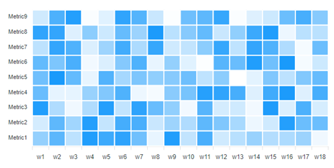

### Time line chart

A time line chart needs two Chart Data Controls per data set. The first is used for the start time of a data point. The second is used for the end time.

*Example*

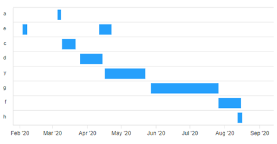

Both controls require a data source item that is either numeric, or (preferably) of Date-time type, and the same value in Series Name, like the Scatter chart:

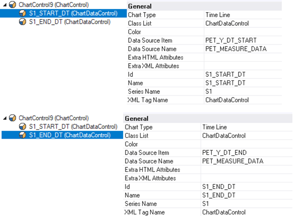

The X-Axis values are rendered along the Y-Axis, there it is not required to set the Orientation property to Horizontal for this chart, because time lines are typically rendered in a horizontal view.

Also, X-Axis labels may also exist multiple times, in which case on the same line more than one group is rendered.

### Brush chart

Brush charts are used as a selector on a detail chart, to view a smaller area of the entire data set whilst also seeing the width of the entire set (which is displayed within the brush chart itself). These brush charts are usually of Line, Bar or Area chart type, whereas the detail chart would usually be a Bar chart. For a brush chart, you do not have to define a data source name and item, as it typically inherits / copies the data directly from its detail chart.

*Example*

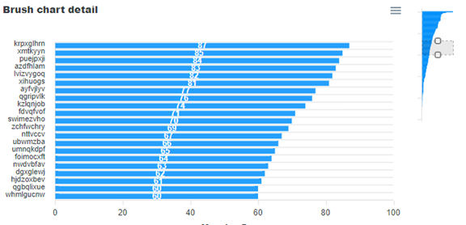

Using the grey selection area on the brush chart, different values can be displayed on the detail chart on the left. The (smaller) brush chart is created by making a new Chart Control with the appropriate styling and size, and by setting its ‘Brush Chart For’ property with the value of the ‘Id’ property of the detail chart. For both charts, the type Line Chart is chosen, with Orientation property set to ‘Horizontal’.

##  