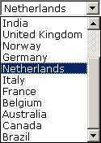
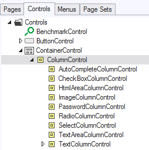
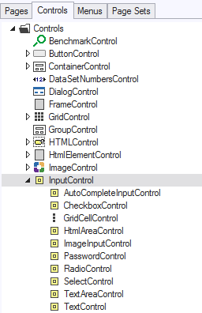

# Column controls and input controls

A  **column control** is a container control that groups an input control and a label. The label is used to show screen text as a prompt for the user.

A column control has **Data Source Name** and **Data Source Item** properties that tie the GUI construct to a database column.

In the following example, the column control is of type "TextColumnControl", and the input control it contains is of type "TextControl":

 

### Types of input control

 

The types of input control that USoft supports by default are:

|**Input Control Type**|**Example**|
|--------|--------|
|AutoCompleteInputControl|

|
|TextControl|

|
|TextAreaControl|

|
|CheckboxControl|

|
|RadioControl|

|
|SelectControl|

|
|PasswordControl|

|
|HTMLAreaControl|

|

### Using default column controls

USoft automatically creates column controls for you in the default application. These column controls are based on model definitions in USoft Definer. The realisation of these default column controls in the UI depends mostly on the Display Type attribute of the underlying domain.

### Creating your own column controls

You can also create column controls yourself. To do this, drag a column control class from the Controls catalog onto the object tree. Then, connect the control with a database column by setting the **Data Source Name** and **Data Source Item** properties manually. The column controls in the Controls catalog look like this:

Or, you can assemble column control containers yourself by manipulating input controls directly. This also allows you to create surface controls that have no connection to the database. The input control classes in the Controls catalog look like this:

### Resetting an input control's Type

Finally, you can also convert the type of an existing input control to a different type. Do this by editing the Type property of the contained Data object. Here is a mapping between input control types and values for the Type property:

|**Input Control Type**|**Value of Type property**|
|--------|--------|
|AutoCompleteInputControl|autocomplete|
|TextControl|text    |
|TextAreaControl|textarea|
|CheckboxControl|checkbox|
|RadioControl|radio   |
|SelectControl|select  |
|PasswordControl|password|
|HTMLAreaControl|htmlarea|