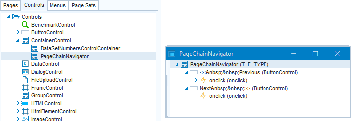

# Container controls

You can create Container controls that are made up of multiple objects. You can then insert the Container in multiple pages in your application.

*Example*

You want a « Previous / Next » navigation panel, made up of 2 push buttons, to appear at the bottom of 5 individual pages that form a wizard-type sequence. This sequence is traversed by the user in order to complete a complex task step-by-step. In the Controls catalog, develop this panel as a custom Container object (here it is called: PageChainNavigator):

You can now insert this button panel into the 5 pages.

Finally, make local changes to each of the 5 pages as required.

> [!TIP]
> **Group or Container ?**
> Use a **Group** control to group, sequence and position objects in a page. Use a **Container** control to create a sub-area of objects and behaviour that you want to re-use across multiple pages. Click [here](/docs/Web_and_app_UIs/Web_Designer_controls/Group_controls.md) to learn more.

## How to define a Container control

To define a Container control:

1. In Web Designer, in the Controls catalog, click on the ContainerControl default control class. Right-mouse-click and choose New from the context menu. A child control class named “ContainerControl - New” appears.
2. Rename this class to a name that is meaningful in your application.
3. Right-mouse-click and choose Open. Develop the class by inserting controls and by setting properties for these controls. Save.

## How to use the Container control in a page

To use the Container control in a page:

1. From the Pages catalog, open the page class(es) where you want the container to appear.
2. Drag-and-drop the Container class from the Controls catalog (on the left) onto the object tree (on the right). Drop the Container where you want it to appear in the page.