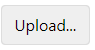
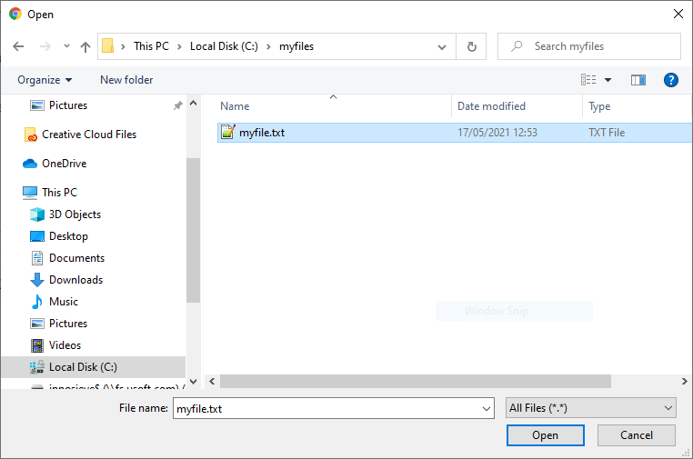
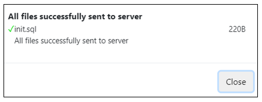
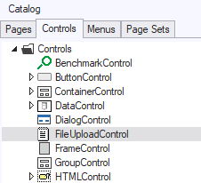
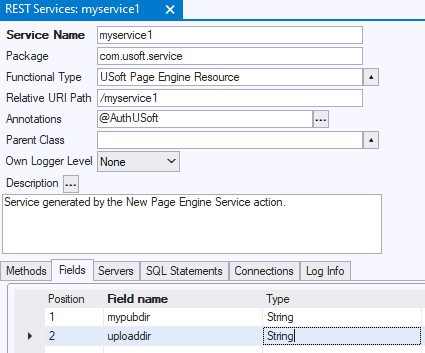
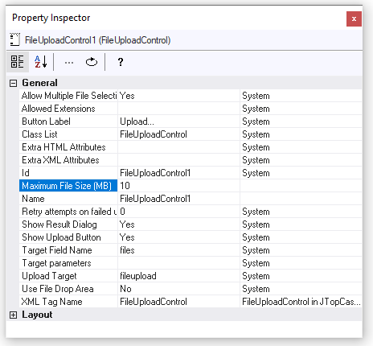

# File Upload controls

From a web page in a USoft application, you can add the possibility to upload files to the server.

One common way of doing this is to provide a push button:



When the user pushes the button, the client browser opens a file selection dialog:



This dialog allows the user to select (identify) one or more files to be uploaded.

If the upload is successful, by default, the selected file or files are instantly sent to the server and added to the server's file system.


:::tip

By default, if you upload **myfile.txt**, the result on the server is called something like:
**1621332385745_myfile.txt**
The numeric prefix is a server timestamp representing milliseconds since January 1, 1970.

:::

The user is given a confirmation message in a dialog:



If the upload is unsuccessful, by default, the user is given an error message in a similar dialog.

Even if you create a minimal file upload facility, you should at the very least:

- Restrict the maximum file size allowed.
- Restrict the file extension(s) allowed.

There are many additional ways to restrict, facilitate, customise and refine file upload operations. You can for example:

- Allow upload of multiple files in 1 go.
- Offer a rectangular area where files can be submitted for upload by drag-and-drop, as an alternative to (or in addition to) offering a push button.
- Get the file(s) uploaded to specific subdirectories on the server.
- Regulate what happens when the file(s) submitted for upload already exist on the server.

## Creating a minimal File Upload control

To create a minimal File Upload control:

1. In Web Designer, insert into your web page an instance of the **FileUploadControl** control class. You can find this class in Web Designer's Controls Catalog:



2. For the inserted control, open the Property Inspector. See that the default value for the Upload Target property is '**fileupload**’.

Accept this default. You must now set the directory on the server file system that corresponds to the default '/fileupload' endpoint (Step 3).

3. In Service Definer, add a new Field to the REST Service that acts as your application's Page Engine. Call this field by any name, for example, 'uploaddir'. For this new field, set Type =

```language-java
String
```


:::warning

This Type value is case-sensitive.

:::



4. For this new field, set Default Value =

```language-java
setUploadDir(*target-directory*)
```

where *target-directory* is the directory on the server where you want uploaded files to appear, making sure you escape backslashes. For example:

```language-java
setUploadDir("c:\\temp\\incoming")
```

5. Press the Check button. See that the REST Service goes back to Correct = Yes.

6. For the Server, execute Publish and Restart.

### Restricting the maximum file size allowed

Make sure you restrict the maximum file size allowed both **on the server** and **on the client**.

To restrict the maximum file size allowed **on the server**:

1. In Service Definer, add a new Field to the REST Service that acts as your application's Page Engine. Call this field by any name, for example, 'maxfilesize'. For this new field, set Type =

```language-java
boolean
```


:::warning

This Type value is case-sensitive.
This Type value is necessary even though, functionally, it does not make sense (there is no relevant boolean return value).

:::

2. For this new field, set Default Value =

```language-java
setUploadMaxFileSize(*max-file-size*)
```

where *max-file-size* is an integer indicating, in MBs, the maximum file size allowed for each individual uploaded file. For example, for a maximum file size of 10 MB:

```language-java
setUploadMaxFileSize(10)
```

3. Press the Check button. See that the REST Service goes back to Correct = Yes.

4. For the Server, execute Publish and Restart.

 

To restrict the maximum file size allowed **on the client**:

1. In Web Designer, open the Property Inspector for the File Upload control inserted in your page.

2. Set the **Maximum File Size (MB)** property:



### Restricting file types (file extensions) allowed

To restrict the file types (file extensions) allowed:

1. In Service Definer, add a new Field to the REST Service that acts as your application's Page Engine. Call this field by any name, for example, 'filetypes'. For this new field, set Type =

```language-java
boolean
```


:::warning

This Type value is case-sensitive.
This Type value is necessary even though, functionally, it does not make sense (there is no relevant boolean return value).

:::

2. For this new field, set Default Value =

```language-java
setUploadAllowedExtensions(new String[]{*allowed-file-extensions*})
```

For example, to allow only MS Word files and PDF files:

```language-java
setUploadAllowedExtensions(new String[]{"doc", "docx", "pdf"})
```

3. Press the Check button. See that the REST Service goes back to Correct = Yes.

4. For the Server, execute Publish and Restart.

## File Upload control properties

You can set properties to customise the File Upload control inserted in your page.

Open the Property Inspector for this File Upload control. Make property settings as appropriate.


:::note

To explore possibilities, use the Property Help. Click on a property name. Read the Help text for the clicked property (in a yellow pane). If you do not see Help text, click the ‘?’ icon in the Property Help icon ribbon.

:::

*Example*

To offer a rectangular area where users can drag-and-drop the files they want to upload, use the **Use File Drop Area** property.

## Scripted file-upload behaviour with $.udb.upload()

You can script file upload behaviour at the level of the client UI by calling **$.udb.upload()** from Web Designer properties that are open to scripting.

For more detail, search **$.udb.upload()** in the [Developer Reference Guide](/docs/Web_and_app_UIs/UDB_udb/udbupload.md).

## Job handling file-upload requests

You can create a **job** that handles file-upload requests exactly the way you want it. Here are some of the things you can typically achieve by creating a job for handling file upload:

- You can influence the target directory of the uploaded file(s).
- You can influence the name of the uploaded file on the server.
- You can customise error handling.
- You can influence what happens if a file with the submitted or computed name already exists.

### File-upload job

In USoft Definer, create a job with any name, for example, HANDLE_FILE_UPLOAD. Make sure this job accepts at least a DESTINATION and a FILENAME input parameter. Define the job in such a way that:

- The DESTINATION****parameter defines or computes the full folderpath leading to the location where the submitted file(s) must be uploaded.
- The FILENAME****parameter represents or computes the filename and file extension of the uploaded file(s).


:::warning

You can choose any job name, but the DESTINATION and FILENAME parameters must be called exactly that, and not (for example) FILE_NAME.

:::

To add further parameters, use either the **Target parameters** property of the File Upload control in Web Designer, or the **params** parameter if you are programming a call to **$.udb.upload()** (previous section in this article).

Next, in Service Definer, add a new Field to the REST Service that acts as your application's Page Engine. Call this field by any name, for example, 'job'. For this new field, set Type =

```language-java
String
```


:::warning

This Type value is case-sensitive.

:::

For this new field, set Default Value =

```language-java
setJobName(*job-name*)
```

For example, to call the job named HANDLE_FILE_UPLOAD:

```language-java
setJobName("HANDLE_FILE_UPLOAD")
```

### Output parameters for file-upload job

For each file-upload job, you can optionally define an output parameter set that contains the following 2 fields (= output parameters):

- a RESULT parameter containing a message about the uploaded file;
- a STATUS parameter that specifies whether the job executed successfully or not.


:::warning

You can choose any name for the External Set that you use as the job’s Output Parameter Set, but the RESULT and STATUS parameters must be called exactly that.

:::


:::tip

The use of an output parameter set is optional, but best practice is to make sure that the job always returns an output parameter set with exactly one record, with the RESULT parameter containing a relevant message, and the STATUS parameter set to ‘PROCESSED’ if the call was successful and to 'REJECTED’ if an error occurred.

:::

The value of the RESULT message is determined by the developer of the job, so it may contain any type of message, including messages caught from the Rules Engine. You can catch Rules Engine messages by calling the Rules Engine internal component; use the **StartCatchingErrors()** and **StopCatchingErrors()** methods, in combination with the **GetLastCaughtErrors()** or **GetLastCaughtErrorsAsXML()** methods. You need to distinguish any custom messages delivered via the RESULT parameter from the standard error message delivered automatically by USoft if the job fails as a whole.

The value of the STATUS parameter is determined by the developer of the job, but this value must be one of a predefined set of allowed values, or else an error is produced to the effect that the STATUS value is not allowed and STATUS is set to ‘REJECTED’ instead. The predefined set of allowed values for STATUS is as follows:

|**Value**|**Meaning**|
|--------|--------|
|PROCESSED|The file-upload operation was completed successfully.|
|REJECTED|The file-upload operation was not completed successfully.|
|ERROR   |A fatal error occurred.|


Best practice is to make sure that the job always yields a status of ‘PROCESSED’ if successful and always yields a status of ‘REJECTED’ if not successful.