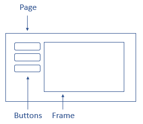

# Frame controls

A **frame control** is a rectangular area in a web page GUI that of which the content varies dynamically during page use.

For example, you could have a Page containing a group of Buttons and a Frame control. Each time the user clicks a different button, different content is displayed in the frame:



To achieve that clicking Button_1 results in displaying Content_1 in the frame called Frame_1, set the **onclick** event of Button_1 to:

```js
$.udb.navigateTo('Content_1',{targetFrame:'Frame_1'});
```

## How to create a frame control

To create a frame control in a web page:

1. Open the web page class where you want to insert a frame control.
2. From the Controls catalog on the left, drag a FrameControl onto the object tree on the right at the point where you want the frame control inserted.

## Frame control in default menu implementation

The USoft default web application has the ApplicationPage default class as its start page (as determined by the StartPage property of the Publication Configuration used to publish the web pages).

In ApplicationPage, when the user clicks an option in the ApplicationMenu, a FrameControl is used to define the rectangular area where the contents associated with the clicked menu option is to be displayed:


By default, this is achieved by setting, for the menu option:

```js
URL = Content_1
```

This is equivalent to setting, for the menu option, and instead of the URL setting:

```js
Script(js) = $.udb.navigateTo(
     'Content_1'
,    {
       targetFrame:'ApplicationFrame'
})
```

## Data sources and frame controls

The USoft implementation of frame controls is an example of [page chaining](/docs/Web_and_app_UIs/Navigation_between_web_pages/Page_chaining.md) and not of [page stacking](/docs/Web_and_app_UIs/Navigation_between_web_pages/Page_stacking.md). Page chaining implies that, when you navigate from one page to another in a frame, and the first page contains a data source A and the second page also contains a data source called A, then data is automatically carried over from data source A on the first page to data source A on the second page.

This fact has a number of implications.

> [!CAUTION]
> Data sources within the frame and data sources outside the frame cannot be interlinked by defining **Lookup** or **Related** objects.

> [!CAUTION]
> You cannot use hierarchical data source path notation (eg., **../../MYDATASOURCE**) to refer from a data source within the frame to a data source outside the frame.

You can control what the frame displays by calling the **navigateTo()** action.

> [!CAUTION]
> You cannot achieve this by calling **NavigateToLookup()** or **NavigateToRelated()**.

> [!TIP]
> If you require the linking possibilities of Lookup and Related objects,hierarchical data source path notation, and NavigateToLookup() and NavigateToRelated(), then use an embedded page and not a FrameControl. You can embed a Page 2 into a surrounding Page 1 by first opening Page 1 and then dragging Page 2 from the Pages catalog on the left onto the top-level “Page 1 (Page)” node in the object tree on the right.

 