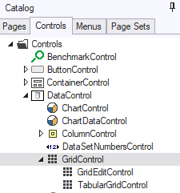
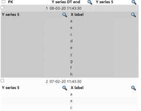

# Grid controls

**See also**

You can display multiple records of a table in a matrix-type form: a grid. In a grid, rows are for records and fields are for columns.

Create a grid by inserting a GridControl or a GridEditControl.A GridEditControl is a GridControl with the Read Only property set to No instead of Yes. See also "Tabular grid controls".

You can insert these control classes by dragging them from the Controls catalog on the left:

By default, a GridControl or GridEditControl contains a radio button, implemented as a SelectorControl (see below), to the left of each record displayed. When the user manipulates the grid, exactly one of the rows will be the current row at any one time. The current row is displayed by a contrasting background color and by the fact that the radio button is selected for this row only.

## GridCellControl

GridCellControl is a subclass of InputControl and has some extra properties. It is the only InputControl that is directly linked to a data source. All other input controls are linked to data through one of the subclasses of ColumnControl.

## SelectorControl

The purpose of a SelectorControl is to identify which record in a multi-record display is the selected record.

This control is of the "radio button group" type: if you click one button, this causes the previously clicked button to be de-selected. As a result, exactly one record is selected at any one time.

## MarkRecordControl

The purpose of a MarkRecordControl is to mark several records of a data source, so that you can perform a combined operation on all of the marked records, for example, deleting all the marked records, or refreshing the values of all marked records.

This control is of the "checkbox" type.

## RecordNumberControl

The purpose of a RecordNumberControl is to display the index number of the displayed record.

## Data filtering

Filtering of data values of a column is enabled by setting the “Show Filter” property of the GridCellColumn to ‘Yes’, which displays a magnifying glass icon:

for the respective column in its header row. In the runtime web application, clicking this icon causes a list of the values for that specific column to be displayed:

## Sorting of columns

When, for a GridCellColumn in a grid, the “Enable sorting on header” property is set to “Yes”, then the displayed records can be sorted by clicking on that column’s grid header. This will trigger a re-query of the data being displayed, unless a client-side sorting function is configured using the API, in which case the data are sorted within the browser. After sorting, an arrow icon is displayed depicting the sorting order: up for ascending order, and down for descending order.