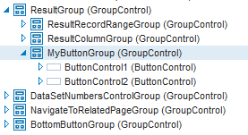

# Group controls

Web Designer objects exist in an object ownership hierarchy or tree structure. Larger objects own smaller objects. In this hierarchy, GroupControl objects are special, because containing other objects is their main purpose. GroupControls make it easier to organise the layout of collections of like objects.

The column controls ("fields”) that USoft generates in default infoPages are contained by GroupControls. This allows USoft to align the fields horizontally or vertically, to sort them into a predefined order, and to position them on the page as a group.

As a developer, you may want to group objects yourself, for the same reasons. Here is a button group containing 2 push buttons:

> [!TIP]
> **Group or Container ?**
> Use a **Group** control to group, sequence and position objects in a page. Use a **Container** control to create a sub-area of objects and behaviour that you want to re-use across multiple pages. If the MyButtonGroup of the example is a « Previous / Next » twin set of buttons that you want to look the same, and partly work the same, in all 5 pages of a sequence of 5 individual "wizard” pages, then create a Container for them, insert this Container in all the 5 pages, then make local edits to get local button behaviours.
> The difference is subtle. The object tree as shown in the picture is a representation of the DOM object structure held in the browser when your page is browsed at runtime. But USoft implements its Page class and Controls class inheritance rules in a *different* structure than the DOM. This structure is embodied in the relationships between so-called ESI records, especially the records in the T_E_TYPE table. These are the records that you manipulate when you define objects, classes and properties in the Web Designer tool.
> Objects you group in a Group control are still each other's siblings in the ESI structure: they remain direct children of the top-level Page object. As you move them around and perhaps re-group them, inheritance rules continue to apply.
> Objects you contain in a Container control are only children of the inserted top-level Container object. You may count on inheritance to shape some of the look-and-feel and behaviour of your Container, but if you move the Container to a different place, these inheritance relationships will be lost and you will need to review or recreate them.

## How to group objects

To group objects:

1. Insert a Group control into the object tree, at the point where you want the group. Do this by dragging a GroupControl from the Controls catalog. You can also use the Insert, GroupControl menu option.
2. In the object tree, multiple-select the objects you want to group. Do this by clicking them while you hold the CTRL or SHIFT key down.
3. Drag the selected objects onto the Group Object.

Another way to group objects is to set their Group property to the name of the GroupControl.

## How to change the orientation of grouped objects

If the parent object has a vertical orientation, then its objects are arranged above and below each other, as in columns. If a parent object has a horizontal orientation, then its child objects are arranged next to each other, as in rows.

To change the orientation of an object:

1. From the catalog, open the page for which you want to change the layout.
2. In the object tree, select the parent object.
3. Open the Property Inspector.
4. Set the Orientation property to Horizontal or Vertical.
5. Save your work.

## How to change the order of objects in a group

The order in which grouped objects are sorted is determined by their Position property. To change this order:

1. In the object tree, select the object for which you want to change the order.
2. Open the Property Inspector.
3. Set the Position property to a sequence number.

Objects with a lower sequence number in the group appear earlier (higher if the orientation is vertical, more to the left if it is horizontal). You don't need a strict 1, 2, 3… sequence of numbers. There may be gaps. Even multiple objects with the same number are allowed: USoft will sort these in random order.