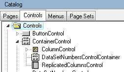
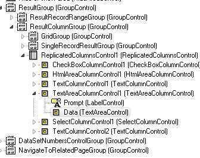
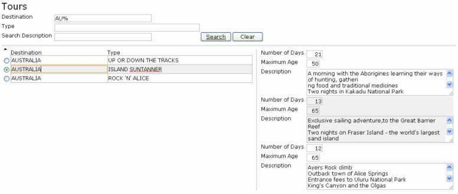
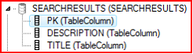
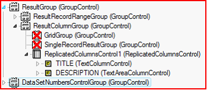
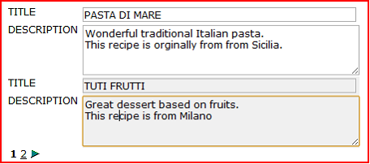

# Replicated Columns Control

The Replicated Columns Control acts as a grid for single record controls. It is a subset of the Container Control:

 

The only function of the RCC is to repeat all the controls it contains for each row in the Data Source it is associated with. You can place several other controls in a Replicated Columns Control, for example:

 

In the web application, several rows are displayed as multiple Replicated Columns Controls. For example, in the following screenshot, you can see three rows, where the second row is the selected row:

 

Quick steps for using a Replicated Columns Control:

1. Place a Replicated Columns Control onto the page.

2. Associate the Replicated Columns Control with a data source.

3. Place some Column Controls inside the Replicated Columns Control.

4. Associate all Column Controls with the same data source as the Replicated Columns Control and choose a specific data source Item for each Column Control.

### Replicated Columns Control Example

Searchresults  (1 field  title + 1 multi line field description)

Will display as:

