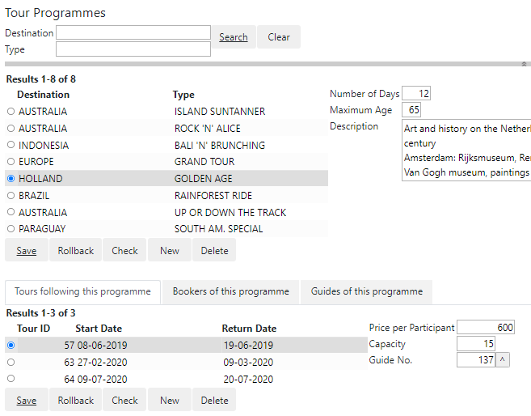
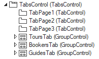

# Tabs (Web Designer)

## Tabs in web pages

You can display related information on tab pages. Here is an example where Tours, Bookers and Guides of the selected Tour Programme are displayed on 3 tabs at the bottom of the page. In this particular example, the tabs contain related queries on child tables of the Tour Programme table. As a result, the content shown in the tabs changes ("moves along”) with the selection the user makes in the top box:



Tour Programmes info box with related information on 3 tab pages## How to build

To realise tabs in web pages:

1. From the Controls catalog on the left, drag a TabControl (not: a TabControl) onto the appropriate node of the object tree on the right. To get tabs in the main page, drag the TabControl onto the top-level (Page) node.
2. For each tab page you require, drag a TabControl from the catalog onto the TabControl.
3. (Suggested:) For each tab page, insert a Group control into the TabControl. You can do that by dragging from the catalog or by choosing Insert, Group from the menu. The object tree should now look something like this:



4. For each TabControl, in the Property Inspector, set the property to the title you want the tab to display. Set the property to the Id of the Group control that holds the contents for that tab page.


:::warning

While the Group controls are shown by their Name property in the object tree, you must be careful in the **Panel** property to refer to the **Id** and not to the Name of the Group control. Avoid confusion by keeping the Name and Id identical if you can.

:::

5. Make sure each Group control contains the content that you want the corresponding tab page to show.

You may want to add some extra margin above the tabs, and some extra vertical space for the tab titles:

```language-css
.uiTabsControl.tabs {
	margin-top:30px;
}

.uiTabsControl.tabs > ul.nav.nav-tabs li a {
	height:40px;
)
```

 