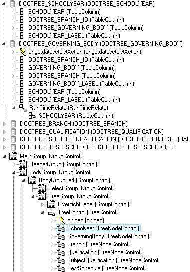

# Tree controls and tree node controls

Tree controls and their associated tree node controls can be found under the Controls tab of the Controls Tree.

Tree views are typically used to display parent-child-grandchild-etc data. Clicking the item in the tree view will make this record the current record in the associated data source: associated fields elsewhere on the page will respond to this. This means that when you have built your tree view all you need to do is associate some fields to the data source and you are able to view and edit the data without any additional coding.

## Summary

The components that make up a working tree view are: Tree Control, for each level in the tree a Tree Node Control, one Table Data Source for each type of root node and for each child node a Related Data source. In the tree control you specify which node is the root node. With each Node you specify which node(s) is (are) its child node. A node may be its own child node.


:::note

The tree view handles the synchronization between the data sources therefore you should clear the synchronization table property of the relate on the associated related data source.

:::


:::note

It is only possible to associate a Tree Node Control with one column of a data source and this is the column that will displayed in the tree view. To display more then one column in the tree view: add an extra column to the data source and use its output expression to concatenate multiple columns: e.g. column1 \|\| ': ' \|\| column2. Then associate the Tree Node Control with this extra column.

:::

Quick steps for setting up a tree view:

1. Insert a Tree Control using the controls tab of the catalog.

2. Insert A Tree Node Control for each root node and also one for each child node.

3. Name all Tree Node Controls after the data they represent by setting the name property.

4. Set the root nodes property of the Tree Control to the names of all intended root nodes.

5. Set the child property of the Tree Control to the names of the intended child nodes.

6. Insert a Table Data source for each root node and a Related data source for each child node.

7. Clear the synchronization table property for the Related data sources.

8. Associate all nodes with the data sources by setting the data source and data source item properties.

## TreeControl

The TreeControl is a Box control, which means that it can be contained by other Box controls such as the GroupControl, ContainerControl and the Page.

The TreeControl acts as the holder of a tree structure. The TreeControl can only contain TreeNodeControls and EventListeners.

By default, the TreeControl contains an onload EventListener. This EventListener contains a callClientScript action, by default, with the following script:

```
initTree(this)
```

This will initialize the tree in the browser whenever the page is loaded.

The most important property of the TreeControl is Root Nodes. The value of this property is a list of TreeNodeControl names that act as root nodes in the tree.

## TreeNodeControl

The TreeNodeControls are Data Source-based controls. By default, they contain a number of EventListeners and scripts.

TreeNodeControls can only be contained in a TreeControl. TreeNodeControls can only contain EventListeners and scripts. The main properties of the TreeNodeControls are listed in the following table:

|**Name**|**Description**|
|--------|--------|
|Data Source Name|Name of the referred DataSource|
|Data Source Item|Name of the referred DataSource item|
|Child Nodes|List of TreeNodeControl names that act as its child nodes|
|Image   |URL for the image of this node. Default is *images/folder.png*|


The Data Source Name and the Data Source Item properties bind the node to the data. The following figure illustrates their relationship:



 

In this figure, the TreeControl has one root node: Schoolyear. This node is bound to 'DOCTREE_SCHOOLYEAR/SCHOOLYEAR_LABEL'. It has one child node: GoverningBody.


GoverningBody is bound to 'DOCTREE_GOVERNING_BODY/GOVERNING_BODY_LABEL'. This process is repeated for the other nodes.

The child nodes are related to their parent nodes with a *Run Time Relate*. This is a standard Relate object, except that the property *Synchronization DataSource* is left empty.