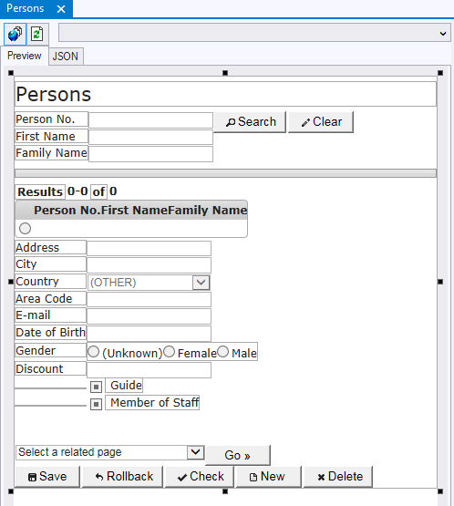
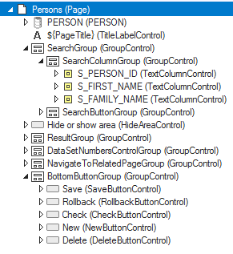

# The Preview Pane

The Preview Pane appears by default in the centre of the Web Designer tool interface. This pane contains a tabbed window for each Page class, Control class, and Menu that you have opened from the catalog:

 

**Preview Pane**

In the case of Menus opened from the catalog, the Preview Pane displays the menu structure and menu items.

In the case of Page classes and Control classes opened from the catalog, the Preview Pane offers a preview version of that class. This gives you a visual impression of how the Page or Control will look when published, but note that for various technical reasons, the look-and-feel that the user is ultimately presented with may be quite different.

Perhaps more usefully, the Preview Pane also lets you find and select important objects in the page or control, such as a button. By clicking on that object in the Preview Pane, the Object Tree is expanded and the corresponding item in the Object Tree receives input focus. In the picture of the Web Designer tool interface the Rollback button at the bottom of the Reservations pane is currently selected. This is shown by handles (small black rectangles around the button) in the Preview Pane and by a contrasting background color in the Object Tree on the right.

The Preview Pane also offers a JSON code preview. To see this code preview, click the JSON tab in the centre of the screen.

Web Designer's Object Tree appears by default on the right-hand side of the Web Designer tool interface. It accompanies the Preview Pane and is opened with it when you open a Page or Control from the catalog.  

**Object Tree**

The object tree is a hierarchical list of all the objects contained in the page. Most importantly, it lets you open the Property Inspector for a specific object in the Page, so that you can view and edit that object's properties.